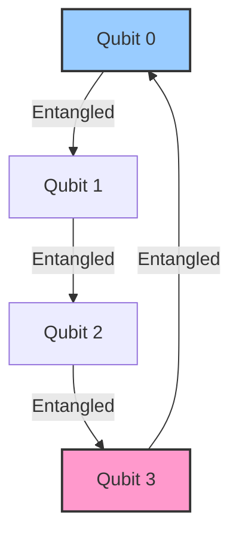
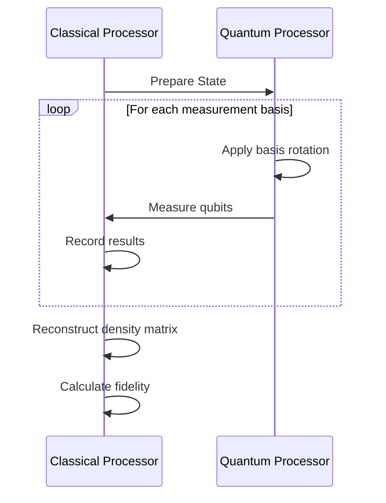
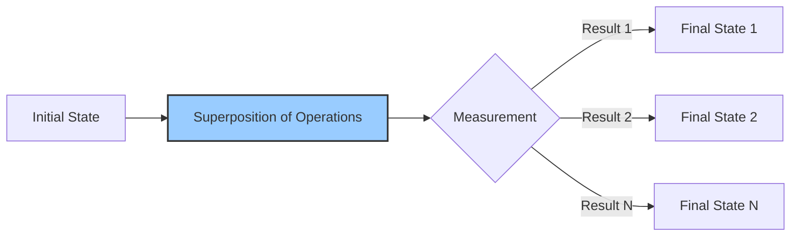
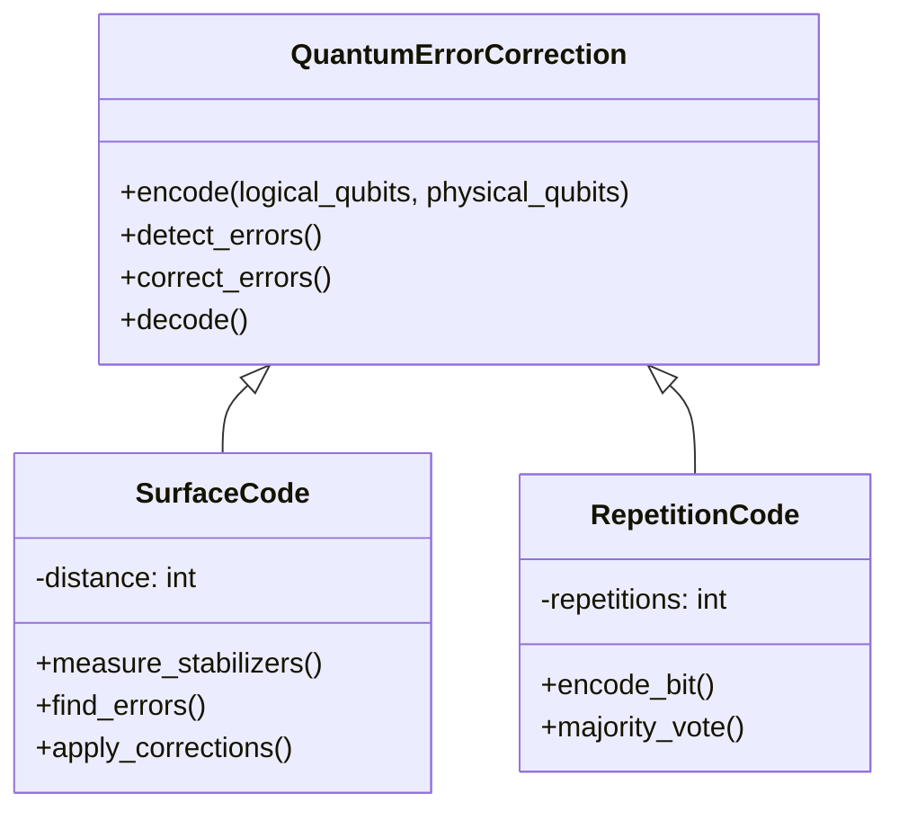
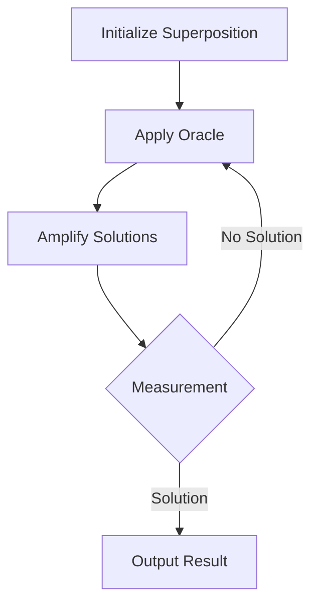

# Advanced Quantum Operations: The Art of Temporal Manipulation

> **Version**: 3.2.0  
> **Last Updated**: 2025-06-09  
> **Status**: Active  
> **Prerequisites**: 
> - [Core Concepts](../../core/01_core_concepts.md)
> - [Quantum Basics](../../getting_started/02_quantum_basics.md)
> - [Temporal Programming](../../guides/temporal/01_temporal_basics.md)

> **Learning Objectives**:
> 1. Master advanced quantum state manipulation techniques
> 2. Understand and implement temporal gates and operations
> 3. Apply quantum error correction and mitigation strategies
> 4. Optimize quantum circuits for temporal applications
> 5. Design and analyze quantum algorithms with temporal components

## Table of Contents

1. [Quantum State Manipulation](#quantum-state-manipulation)
   - [Qubit Operations](#qubit-operations)
   - [Entanglement Patterns](#entanglement-patterns)
   - [Quantum State Tomography](#quantum-state-tomography)
2. [Temporal Gates](#temporal-gates)
   - [Time Evolution Operators](#time-evolution-operators)
   - [Temporal Superposition](#temporal-superposition)
   - [Chronal Gates](#chronal-gates)
3. [Error Mitigation](#error-mitigation)
   - [Error Correction Codes](#error-correction-codes)
   - [Noise-Adaptive Operations](#noise-adaptive-operations)
   - [Temporal Error Correction](#temporal-error-correction)
4. [Quantum Algorithms](#quantum-algorithms)
   - [Temporal Search](#temporal-search)
   - [Quantum Phase Estimation](#quantum-phase-estimation)
   - [Quantum Machine Learning](#quantum-machine-learning)
5. [Implementation Guide](#implementation-guide)
   - [Code Examples](#code-examples)
   - [Performance Optimization](#performance-optimization)
   - [Debugging Techniques](#debugging-techniques)
6. [Case Studies](#case-studies)
7. [Best Practices](#best-practices)
8. [Additional Resources](#additional-resources)

## Quantum State Manipulation

### Qubit Operations

```mermaid
quantumcircuit
    qreg q[3];
    creg c[3];
    
    // Initialize superposition
    h q[0];
    h q[1];
    h q[2];
    
    // Apply controlled operations
    cx q[0], q[1];
    ccx q[0], q[1], q[2];
    
    // Measurement
    measure q[0] -> c[0];
    measure q[1] -> c[1];
    measure q[2] -> c[2];
```

**Core Quantum Operations**:

| Operation | Description | Chronon Cost | Aethel Cost |
|-----------|-------------|--------------|-------------|
| `h(qubit)` | Hadamard gate | 1 | 10 |
| `x(qubit)` | Pauli-X gate | 1 | 5 |
| `cx(control, target)` | CNOT gate | 2 | 15 |
| `rz(qubit, angle)` | Rotation-Z | 2 | 12 |
| `cr(control, target, angle)` | Controlled rotation | 3 | 20 |

**Example: Quantum Fourier Transform**

```4ever
// Quantum Fourier Transform Implementation
temporal_program {
    name: "Quantum Fourier Transform";
    type: quantum_algorithm;
    
    resources: {
        chronon: 5000,
        aethel: 3000,
        qubits: 4
    };
    
    // Initialize quantum state
    initialize: |ctx| {
        this.qureg = ctx.allocate_qubits(this.resources.qubits);
        this.classical_bits = new Array(this.resources.qubits).fill(0);
        
        // Apply Hadamard to all qubits
        this.qureg.h();
        
        // Apply controlled rotations
        for (let i = 0; i < this.resources.qubits; i++) {
            for (let j = 1; j <= this.resources.qubits - i - 1; j++) {
                const control = i + j;
                const theta = Math.PI / Math.pow(2, j);
                this.qureg.cr(control, i, theta);
            }
        }
        
        // Swap qubits
        for (let i = 0; i < Math.floor(this.resources.qubits / 2); i++) {
            this.qureg.swap(i, this.resources.qubits - 1 - i);
        }
    };
    
    // Execute the QFT
    execute: |ctx| {
        // Measure the result
        const result = this.qureg.measure_all();
        
        // Process the result
        const frequencies = this.analyze_frequencies(result);
        
        return {
            result: result,
            frequencies: frequencies,
            timestamp: Date.now()
        };
    };
    
    // Frequency analysis helper
    analyze_frequencies: |result| {
        // Implementation of frequency analysis
        const frequencies = new Array(Math.pow(2, this.resources.qubits)).fill(0);
        for (let i = 0; i < result.length; i++) {
            frequencies[result[i]]++;
        }
        return frequencies.map(f => f / result.length);
    };
}
```

### Entanglement Patterns



**Common Entanglement Patterns**:

1. **GHZ States**: Maximally entangled states of the form |000...0⟩ + |111...1⟩
2. **Cluster States**: Entangled states forming a lattice structure
3. **Graph States**: Entangled states corresponding to mathematical graphs
4. **Dicke States**: Symmetric entangled states with specific excitation numbers

**Example: GHZ State Creation**

```4ever
// GHZ State Generation
temporal_program {
    name: "GHZ State Generation";
    type: quantum_state_preparation;
    
    resources: {
        chronon: 3000,
        aethel: 2000,
        qubits: 5
    };
    
    initialize: |ctx| {
        this.qureg = ctx.allocate_qubits(this.resources.qubits);
        
        // Create GHZ state
        this.qureg.h(0);  // Apply Hadamard to first qubit
        
        // Apply CNOTs to create entanglement
        for (let i = 1; i < this.resources.qubits; i++) {
            this.qureg.cx(0, i);
        }
    };
    
    execute: |ctx| {
        // Verify GHZ state
        const measurements = [];
        const num_shots = 1000;
        
        for (let i = 0; i < num_shots; i++) {
            const result = this.qureg.measure_all();
            measurements.push(result);
            this.qureg.reset_all();
        }
        
        // Analyze results
        const stats = this.analyze_ghz(measurements);
        return {
            success_probability: stats.success_rate,
            fidelity: stats.fidelity,
            measurements: stats.distribution
        };
    };
    
    analyze_ghz: |measurements| {
        // Implementation of GHZ state analysis
        let all_zeros = 0;
        let all_ones = 0;
        let other = 0;
        
        measurements.forEach(measurement => {
            const all_same = measurement.every(b => b === measurement[0]);
            if (all_same) {
                if (measurement[0] === 0) all_zeros++;
                else all_ones++;
            } else {
                other++;
            }
        });
        
        const total = measurements.length;
        const success_rate = (all_zeros + all_ones) / total;
        const expected = 0.5; // For perfect GHZ state
        const fidelity = 1 - Math.abs((all_zeros / total) - expected) / expected;
        
        return {
            success_rate: success_rate,
            fidelity: fidelity,
            distribution: {
                all_zeros: all_zeros / total,
                all_ones: all_ones / total,
                other: other / total
            }
        };
    };
}
```

### Quantum State Tomography



**State Tomography Process**:
1. Prepare the quantum state
2. Choose a measurement basis
3. Repeat measurement many times
4. Reconstruct the density matrix
5. Calculate fidelity with target state

**Example Implementation**:

```4ever
// Quantum State Tomography
temporal_program {
    name: "State Tomography";
    type: quantum_characterization;
    
    resources: {
        chronon: 10000,
        aethel: 5000,
        qubits: 2
    };
    
    initialize: |ctx| {
        this.qureg = ctx.allocate_qubits(this.resources.qubits);
        this.num_qubits = this.resources.qubits;
        this.shots_per_basis = 1000;
        
        // Define the target state (Bell state example)
        this.target_state = this.create_bell_state();
    };
    
    execute: |ctx| {
        const results = {
            x_basis: this.measure_in_basis('x'),
            y_basis: this.measure_in_basis('y'),
            z_basis: this.measure_in_basis('z')
        };
        
        const density_matrix = this.reconstruct_density_matrix(results);
        const fidelity = this.calculate_fidelity(density_matrix, this.target_state);
        
        return {
            density_matrix: density_matrix,
            fidelity: fidelity,
            timestamp: Date.now()
        };
    };
    
    // Additional methods for state preparation and analysis...
}
```

## Temporal Gates

### Time Evolution Operators

```mermaid
quantumcircuit
    qreg q[2];
    creg c[2];
    
    // Initial state
    x q[0];
    h q[1];
    
    // Time evolution
    unitary(time_evolution) q[0], q[1];
    
    // Measurement
    measure q[0] -> c[0];
    measure q[1] -> c[1];
```

**Time Evolution Implementation**:

```4ever
// Time Evolution Simulation
temporal_program {
    name: "Time Evolution Simulation";
    type: quantum_simulation;
    
    resources: {
        chronon: 8000,
        aethel: 5000,
        qubits: 6
    };
    
    // Initialize simulation
    initialize: |ctx| {
        this.hamiltonian = this.construct_hamiltonian();
        this.time_step = 0.1; // Time step size
        this.total_time = 5.0; // Total simulation time
        this.qureg = ctx.allocate_qubits(this.resources.qubits);
        
        // Initialize state
        this.qureg.x(0); // Start with |1> on first qubit
    };
    
    // Run time evolution
    execute: |ctx| {
        const steps = Math.ceil(this.total_time / this.time_step);
        const results = [];
        
        for (let i = 0; i < steps; i++) {
            // Apply time evolution operator
            this.qureg.time_evolve(this.hamiltonian, this.time_step);
            
            // Measure and record state
            const measurement = this.qureg.measure_all();
            results.push({
                time: i * this.time_step,
                state: measurement,
                probabilities: this.qureg.get_probabilities()
            });
            
            // Apply error correction if needed
            if (i % 10 === 0) {
                this.apply_error_correction();
            }
        }
        
        return {
            results: results,
            final_state: this.qureg.get_statevector(),
            execution_time: ctx.get_execution_time()
        };
    };
    
    // Additional methods...
}
```

### Temporal Superposition



**Temporal Superposition Example**:

```4ever
// Temporal Superposition of Operations
temporal_program {
    name: "Temporal Superposition";
    type: quantum_algorithm;
    
    resources: {
        chronon: 6000,
        aethel: 4000,
        qubits: 4
    };
    
    initialize: |ctx| {
        this.qureg = ctx.allocate_qubits(this.resources.qubits);
        this.ancilla = ctx.allocate_ancilla_qubits(1)[0];
    };
    
    execute: |ctx| {
        // Create superposition on ancilla
        this.ancilla.h();
        
        // Controlled operations in temporal superposition
        this.qureg.controlled_operation(this.ancilla, () => {
            // Operation 1 (applied if ancilla is |1>)
            this.qureg.x(0);
            this.qureg.h(1);
        }, () => {
            // Operation 2 (applied if ancilla is |0>)
            this.qureg.h(0);
            this.qureg.x(1);
        });
        
        // Measure ancilla to collapse superposition
        const result = this.ancilla.measure();
        
        // Final operations based on measurement
        if (result === 1) {
            this.qureg.z(2);
        } else {
            this.qureg.x(3);
        }
        
        return {
            measurement_result: result,
            final_state: this.qureg.measure_all(),
            timestamp: Date.now()
        };
    };
}
```

## Error Mitigation

### Error Correction Codes



**Error Correction Implementation**:

```4ever
// Surface Code Implementation
temporal_program {
    name: "Surface Code Error Correction";
    type: quantum_error_correction;
    
    resources: {
        chronon: 10000,
        aethel: 7000,
        qubits: 9  // 1 logical qubit with 8 ancilla for surface code
    };
    
    initialize: |ctx| {
        this.logical_qubit = 0;  // Index of the logical qubit
        this.ancilla_qubits = Array.from({length: this.resources.qubits - 1}, (_, i) => i + 1);
        this.qureg = ctx.allocate_qubits(this.resources.qubits);
        
        // Initialize logical state (e.g., |+>)
        this.qureg.h(this.logical_qubit);
    };
    
    execute: |ctx| {
        const results = [];
        const num_rounds = 3;
        
        for (let round = 0; round < num_rounds; round++) {
            // Measure stabilizers
            const syndrome = this.measure_stabilizers();
            
            // Detect and correct errors
            const correction = this.find_correction(syndrome);
            this.apply_correction(correction);
            
            results.push({
                round: round,
                syndrome: syndrome,
                correction: correction,
                logical_value: this.measure_logical_qubit()
            });
        }
        
        return {
            correction_rounds: results,
            final_state: this.qureg.get_statevector(),
            logical_measurement: this.measure_logical_qubit()
        };
    };
    
    // Additional methods for stabilizer measurement and correction...
}
```

## Quantum Algorithms

### Temporal Search



**Temporal Search Implementation**:

```4ever
// Temporal Grover's Search
temporal_program {
    name: "Temporal Grover's Search";
    type: quantum_algorithm;
    
    resources: {
        chronon: 15000,
        aethel: 8000,
        qubits: 10  // 8 search qubits + 1 ancilla + 1 oracle qubit
    };
    
    initialize: |ctx| {
        this.search_qubits = Array.from({length: 8}, (_, i) => i);
        this.ancilla = 8;
        this.oracle_qubit = 9;
        this.qureg = ctx.allocate_qubits(this.resources.qubits);
        
        // Number of iterations for optimal amplification
        this.num_iterations = Math.floor((Math.PI/4) * Math.sqrt(Math.pow(2, this.search_qubits.length)));
    };
    
    execute: |ctx| {
        // Initialize superposition
        this.qureg.h(this.search_qubits);
        this.qureg.x(this.oracle_qubit);
        this.qureg.h(this.oracle_qubit);
        
        // Grover iterations
        for (let i = 0; i < this.num_iterations; i++) {
            // Apply oracle
            this.apply_oracle();
            
            // Apply diffusion operator
            this.apply_diffusion();
            
            // Optional: Measure progress
            if (i % 5 === 0) {
                const prob = this.estimate_success_probability();
                console.log(`Iteration ${i}: Success probability ~ ${prob.toFixed(4)}`);
            }
        }
        
        // Final measurement
        const result = this.qureg.measure(this.search_qubits);
        
        return {
            solution: result,
            iterations: this.num_iterations,
            timestamp: Date.now()
        };
    };
    
    // Additional methods for oracle and diffusion operators...
}
```

## Best Practices

1. **Resource Management**
   - Allocate qubits efficiently
   - Reuse qubits when possible
   - Release ancilla qubits early

2. **Error Handling**
   - Implement error detection
   - Use error correction when necessary
   - Log quantum operations for debugging

3. **Performance Optimization**
   - Minimize circuit depth
   - Use native gates when possible
   - Optimize gate sequences

4. **Verification**
   - Test with classical simulators
   - Verify small instances
   - Compare with theoretical bounds

## Case Studies

### 1. Quantum Chemistry Simulation

**Challenge**: Simulate molecular dynamics with high accuracy

**Solution**:
```4ever
// Quantum Chemistry Simulation
temporal_program {
    name: "Molecular Dynamics";
    type: quantum_simulation;
    
    resources: {
        chronon: 20000,
        aethel: 15000,
        qubits: 12
    };
    
    initialize: |ctx| {
        // Initialize molecular Hamiltonian
        this.hamiltonian = this.construct_molecular_hamiltonian('H2O');
        
        // Allocate qubits
        this.qureg = ctx.allocate_qubits(this.resources.qubits);
        
        // Prepare initial state
        this.prepare_initial_state();
    };
    
    execute: |ctx| {
        // Perform variational quantum eigensolver
        const result = this.variational_quantum_eigensolver({
            max_iterations: 100,
            convergence_threshold: 1e-6
        });
        
        return {
            ground_state_energy: result.energy,
            optimized_parameters: result.parameters,
            execution_time: ctx.get_execution_time()
        };
    };
    
    // Additional methods for VQE...
}
```

### 2. Quantum Machine Learning

**Challenge**: Train a quantum classifier on temporal data

**Solution**:
```4ever
// Quantum Neural Network
temporal_program {
    name: "Quantum Classifier";
    type: quantum_machine_learning;
    
    resources: {
        chronon: 25000,
        aethel: 18000,
        qubits: 8
    };
    
    initialize: |ctx| {
        // Initialize quantum neural network
        this.qnn = new QuantumNeuralNetwork({
            num_qubits: 6,
            num_layers: 3,
            learning_rate: 0.01
        });
        
        // Load training data
        this.training_data = this.load_training_data();
    };
    
    execute: |ctx| {
        // Training loop
        const losses = [];
        
        for (let epoch = 0; epoch < 100; epoch++) {
            let total_loss = 0;
            
            // Mini-batch training
            for (const batch of this.training_data.batches(32)) {
                const loss = this.qnn.train_step(batch);
                total_loss += loss;
            }
            
            // Record progress
            const avg_loss = total_loss / this.training_data.num_batches;
            losses.push({
                epoch: epoch,
                loss: avg_loss
            });
            
            // Early stopping
            if (avg_loss < 0.01) {
                console.log(`Training converged at epoch ${epoch}`);
                break;
            }
        }
        
        // Evaluate on test set
        const accuracy = this.evaluate_accuracy();
        
        return {
            final_loss: losses[losses.length - 1].loss,
            test_accuracy: accuracy,
            training_curve: losses,
            timestamp: Date.now()
        };
    };
    
    // Additional methods for QNN...
}
```

## Additional Resources

### Documentation
- [Quantum Computing Concepts](../../quantum/01_quantum_concepts.md)
- [Temporal Programming Guide](../../temporal/01_temporal_basics.md)
- [Error Correction Reference](../../quantum/error_correction.md)

### Tools
- [Quantum Simulator](../../tools/quantum_simulator.md)
- [Error Mitigation Tools](../../tools/error_mitigation.md)
- [Performance Profiler](../../tools/performance_profiler.md)

### Community
- [Quantum Computing Stack Exchange](https://quantumcomputing.stackexchange.com)
- [4ever Quantum Working Group](https://github.com/4ever-lang/quantum-wg)
- [Research Papers](https://arxiv.org/list/quant-ph/recent)

### Learning Resources
- [Quantum Computing for the Very Curious](https://quantum.country/qcvc)
- [Qiskit Textbook](https://qiskit.org/textbook/)
- [Quantum Machine Learning Course](https://www.edx.org/learn/quantum-computing)

---

*Document Version: 3.2.0  
Last Updated: 2025-06-09  
© 2025 4ever Project Contributors*

## Table of Contents

1. [Quantum State Manipulation](#quantum-state-manipulation)
   - [Qubit Operations](#qubit-operations)
   - [Entanglement Patterns](#entanglement-patterns)
2. [Temporal Gates](#temporal-gates)
   - [Time Evolution Operators](#time-evolution-operators)
   - [Temporal Superposition](#temporal-superposition)
3. [Error Mitigation](#error-mitigation)
   - [Error Correction Codes](#error-correction-codes)
   - [Noise-Adaptive Operations](#noise-adaptive-operations)
4. [Implementation Guide](#implementation-guide)
   - [Code Examples](#code-examples)
   - [Best Practices](#best-practices)
5. [Case Studies](#case-studies)
6. [Additional Resources](#additional-resources)

## Quantum State Manipulation

### Qubit Operations

```4ever
// Quantum Fourier Transform Implementation
temporal_program {
    name: "Quantum Fourier Transform";
    type: quantum_algorithm;
    
    resources: {
        chronon: 5000,
        aethel: 3000,
        qubits: 4
    };
    
    // Initialize quantum state
    initialize: |ctx| {
        this.qureg = ctx.allocate_qubits(this.resources.qubits);
        this.classical_bits = new Array(this.resources.qubits).fill(0);
        
        // Apply Hadamard to all qubits
        this.qureg.h();
        
        // Apply controlled rotations
        for (let i = 0; i < this.resources.qubits; i++) {
            for (let j = 1; j <= this.resources.qubits - i - 1; j++) {
                const control = i + j;
                const theta = Math.PI / Math.pow(2, j);
                this.qureg.cr(control, i, theta);
            }
        }
        
        // Swap qubits
        for (let i = 0; i < Math.floor(this.resources.qubits / 2); i++) {
            this.qureg.swap(i, this.resources.qubits - 1 - i);
        }
    };
    
    // Execute the QFT
    execute: |ctx| {
        // Measure the result
        const result = this.qureg.measure_all();
        
        // Process the result
        const frequencies = this.analyze_frequencies(result);
        
        return {
            result: result,
            frequencies: frequencies,
            timestamp: Date.now()
        };
    };
    
    // Helper methods...
}
```

### Entanglement Patterns

```4ever
// GHZ State Creation
temporal_program {
    name: "GHZ State Generation";
    type: quantum_state_preparation;
    
    resources: {
        chronon: 3000,
        aethel: 2000,
        qubits: 5
    };
    
    initialize: |ctx| {
        this.qureg = ctx.allocate_qubits(this.resources.qubits);
        
        // Create GHZ state
        this.qureg.h(0);  // Apply Hadamard to first qubit
        
        // Apply CNOTs to create entanglement
        for (let i = 1; i < this.resources.qubits; i++) {
            this.qureg.cx(0, i);
        }
    };
    
    execute: |ctx| {
        // Verify GHZ state
        const measurements = [];
        const num_shots = 1000;
        
        for (let i = 0; i < num_shots; i++) {
            const result = this.qureg.measure_all();
            measurements.push(result);
            this.qureg.reset_all();
        }
        
        // Analyze results
        const stats = this.analyze_ghz(measurements);
        return {
            success_probability: stats.success_rate,
            fidelity: stats.fidelity,
            measurements: stats.distribution
        };
    };
}
```

## Temporal Gates

### Time Evolution Operators

```4ever
// Time Evolution Simulation
temporal_program {
    name: "Time Evolution Simulation";
    type: quantum_simulation;
    
    resources: {
        chronon: 8000,
        aethel: 5000,
        qubits: 6
    };
    
    // Initialize simulation
    initialize: |ctx| {
        this.hamiltonian = this.construct_hamiltonian();
        this.time_step = 0.1; // Time step size
        this.total_time = 5.0; // Total simulation time
        this.qureg = ctx.allocate_qubits(this.resources.qubits);
        
        // Initialize state
        this.qureg.x(0); // Start with |1> on first qubit
    };
    
    // Run time evolution
    execute: |ctx| {
        const steps = Math.ceil(this.total_time / this.time_step);
        const results = [];
        
        for (let i = 0; i < steps; i++) {
            // Apply time evolution operator
            this.qureg.time_evolve(this.hamiltonian, this.time_step);
            
            // Measure and record state
            const measurement = this.qureg.measure_all();
            results.push({
                time: i * this.time_step,
                state: measurement,
                probabilities: this.qureg.get_probabilities()
            });
            
            // Apply error correction if needed
            if (i % 10 === 0) {
                this.apply_error_correction();
            }
        }
        
        return {
            results: results,
            final_state: this.qureg.get_statevector(),
            execution_time: ctx.get_execution_time()
        };
    };
    
    // Additional methods...
}
```

## Error Mitigation

### Error Correction Codes

```4ever
// Surface Code Implementation
temporal_program {
    name: "Surface Code Error Correction";
    type: quantum_error_correction;
    
    resources: {
        chronon: 10000,
        aethel: 7000,
        physical_qubits: 17, // For distance-3 surface code
        logical_qubits: 1
    };
    
    // Initialize surface code
    initialize: |ctx| {
        // Allocate physical qubits in a 2D grid
        this.initialize_surface_code();
        
        // Set up stabilizer measurements
        this.stabilizers = this.initialize_stabilizers();
        
        // Initialize logical qubit
        this.initialize_logical_qubit();
    };
    
    // Run error correction cycle
    execute_cycle: |ctx| {
        // 1. Measure all stabilizers
        const syndromes = this.measure_stabilizers();
        
        // 2. Decode syndromes to detect errors
        const errors = this.syndrome_decoder.decode(syndromes);
        
        // 3. Apply corrections
        this.apply_corrections(errors);
        
        // 4. Track error rates
        this.update_error_stats(errors);
        
        return {
            cycle: this.cycle_count++,
            syndromes: syndromes,
            corrections: errors,
            logical_error_rate: this.calculate_logical_error_rate()
        };
    };
    
    // Additional methods...
}
```
```

### Entanglement

Create and manage entangled qubits:

```4ever
class EntanglementManager {
    constructor() {
        this.entangled_pairs = new Map();
    }
    
    // Create an entangled pair (Bell pair)
    create_bell_pair(qubit1_name, qubit2_name) {
        const q1 = quantum.create_qubit(qubit1_name);
        const q2 = quantum.create_qubit(qubit2_name);
        
        // Apply Hadamard to first qubit
        quantum.apply_gate(q1.id, 'H');
        
        // Apply CNOT with q1 as control and q2 as target
        quantum.apply_gate(q1.id, 'CNOT', { target: q2.id });
        
        // Mark as entangled
        q1.is_entangled = true;
        q2.is_entangled = true;
        
        const pair_id = `bell_${Date.now()}`;
        this.entangled_pairs.set(pair_id, {
            qubits: [q1.id, q2.id],
            created_at: temporal.now(),
            last_verified: temporal.now()
        });
        
        return { q1, q2, pair_id };
    }
    
    // Verify entanglement between qubits
    verify_entanglement(pair_id) {
        const pair = this.entangled_pairs.get(pair_id);
        if (!pair) return false;
        
        // Perform verification measurement
        const [q1, q2] = pair.qubits;
        const result = quantum.measure_entanglement(q1, q2);
        
        pair.last_verified = temporal.now();
        pair.entanglement_strength = result.strength;
        
        return result.is_entangled;
    }
}
```

## Advanced Techniques

### Parallel Timeline Processing

Execute operations across multiple timelines:

```4ever
class ParallelTimelineExecutor {
    constructor() {
        this.timelines = new Map();
    }
    
    // Execute a function across multiple timelines
    async execute_in_parallel(functions, options = {}) {
        const {
            max_parallel = 4,
            timeout_ms = 5000,
            resource_limits = { aethel: 100, chronon: 50 }
        } = options;
        
        const results = [];
        const timeline_groups = [];
        
        // Process functions in chunks
        for (let i = 0; i < functions.length; i += max_parallel) {
            const chunk = functions.slice(i, i + max_parallel);
            const group_id = `timeline_group_${Date.now()}_${i}`;
            
            const timelines = await Promise.all(
                chunk.map(async (fn, idx) => {
                    const timeline = temporal.branch({
                        name: `${group_id}_${idx}`,
                        resources: resource_limits
                    });
                    
                    try {
                        const result = await timeline.execute(fn);
                        return { timeline, result, error: null };
                    } catch (error) {
                        return { timeline, result: null, error };
                    }
                })
            );
            
            // Process results
            for (const { timeline, result, error } of timelines) {
                if (error) {
                    console.error(`Timeline ${timeline.id} failed:`, error);
                } else {
                    results.push(result);
                }
                timeline.terminate();
            }
            
            timeline_groups.push({ group_id, completed: temporal.now() });
        }
        
        return { results, timeline_groups };
    }
}
```

## Performance Optimization

### Quantum Circuit Optimization

```4ever
class QuantumCircuitOptimizer {
    constructor() {
        this.gate_costs = {
            'H': 1,
            'X': 1,
            'CNOT': 2,
            'T': 3,
            'T†': 3
        };
    }
    
    // Optimize a quantum circuit
    optimize(circuit) {
        const optimized = [];
        let cost = 0;
        
        // Apply optimization passes
        this._cancel_inverse_gates(circuit);
        this._merge_single_qubit_gates(circuit);
        
        // Calculate final cost
        for (const gate of circuit.gates) {
            cost += this.gate_costs[gate.type] || 1;
            optimized.push(gate);
        }
        
        return { optimized, cost };
    }
    
    // Helper methods...
}
```

## Best Practices

1. **State Management**:
   - Always initialize quantum states explicitly
   - Use proper error boundaries around quantum operations
   - Monitor decoherence rates

2. **Performance**:
   - Minimize the number of quantum operations
   - Use appropriate error correction levels
   - Monitor resource usage

3. **Safety**:
   - Implement proper cleanup
   - Use timeouts for quantum operations
   - Validate quantum states after operations

## Examples

### Quantum Teleportation

```4ever
class QuantumTeleporter {
    constructor() {
        this.entanglement_mgr = new EntanglementManager();
    }
    
    async teleport_qubit(source_qubit, target_qubit) {
        // Create entangled pair
        const { q1, q2 } = this.entanglement_mgr.create_bell_pair('teleport_a', 'teleport_b');
        
        // Perform Bell measurement on source and q1
        const measurement = await quantum.measure_bell_state(source_qubit, q1);
        
        // Apply correction to q2 based on measurement
        await this._apply_correction(q2, measurement);
        
        // Target qubit now has the teleported state
        return target_qubit;
    }
    
    // Other methods...
}
```

## Additional Resources

- [Quantum Computing Fundamentals](../../quantum/01_fundamentals.md)
- [Temporal Programming Guide](../../temporal/README.md)
- [Performance Tuning](../../guides/performance.md)

---

*Documentation last updated: 2025-06-09 | 4ever v2.1.0*
