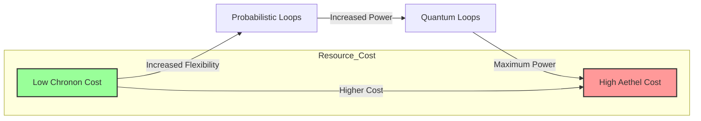
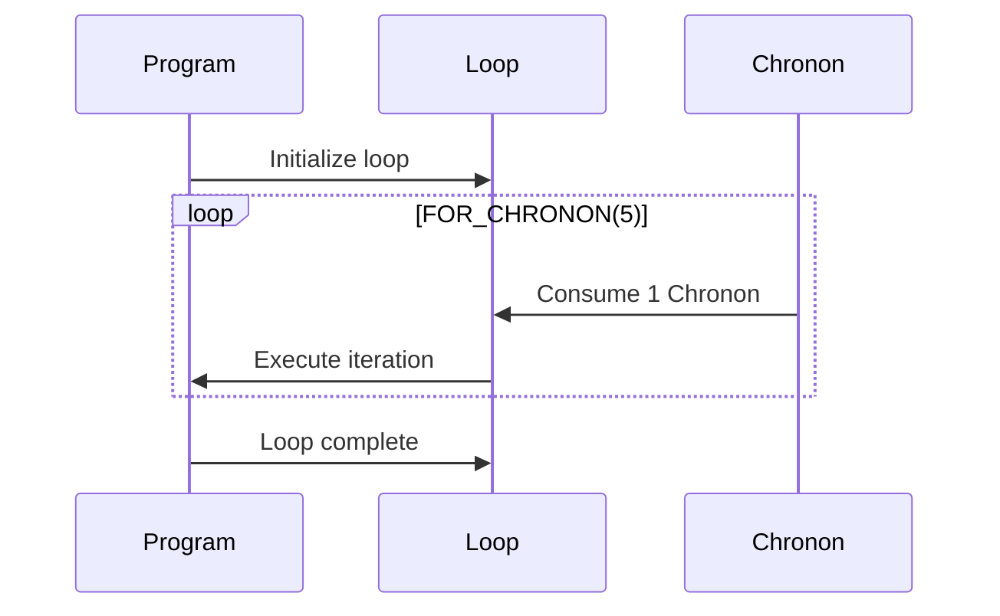
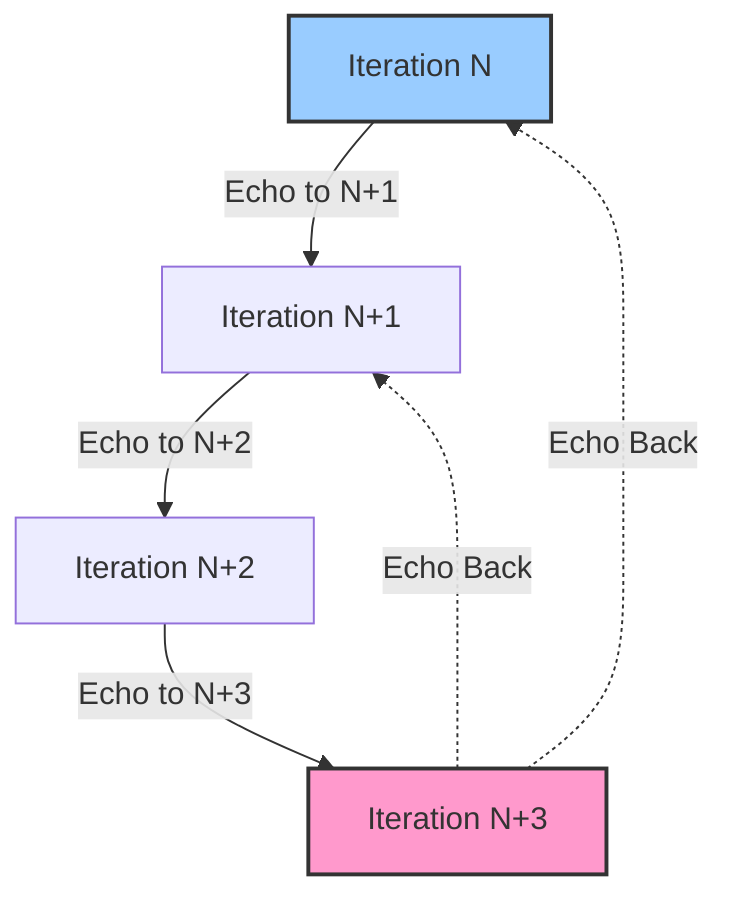
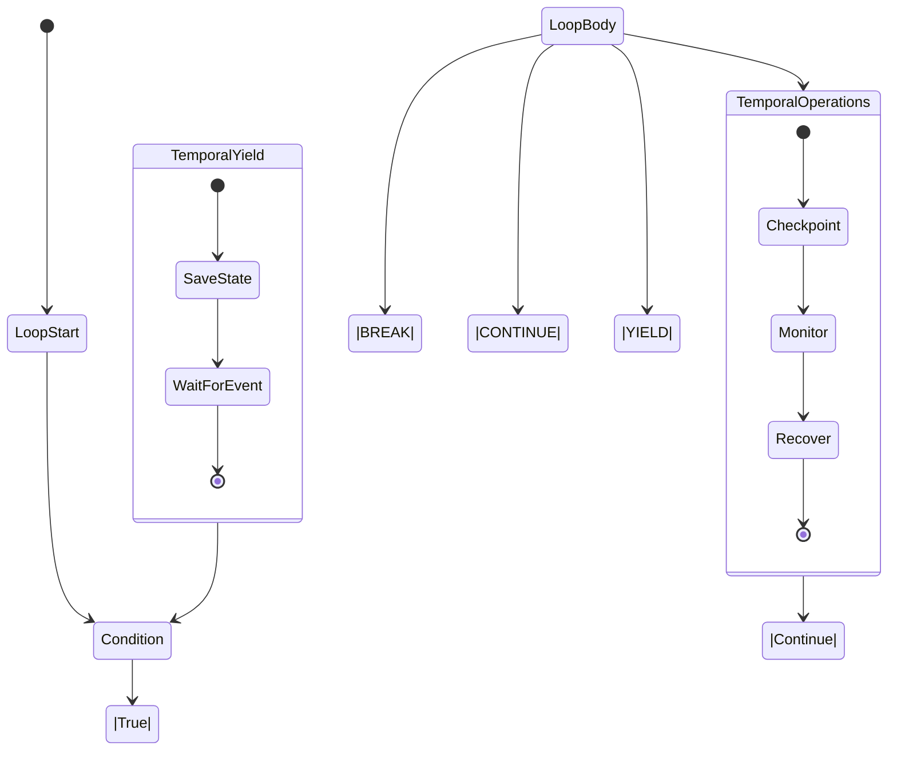

# Loop Mechanics: The Art of Temporal Iteration in 4ever

> **Version**: 2.1.0  
> **Last Updated**: 2025-06-09  
> **Status**: Active  
> **Prerequisites**: 
> - [Core Concepts](../../core/01_core_concepts.md)
> - [Temporal Programming Basics](../../guides/temporal/01_temporal_basics.md)
> - [Resource Management](../../guides/resource_management/01_resource_basics.md)

> **Learning Objectives**:
> 1. Master standard and advanced loop constructs in 4ever
> 2. Understand the temporal implications of different iteration patterns
> 3. Implement efficient and reliable temporal loops
> 4. Balance resource usage between Chronon and Aethel in loops
> 5. Debug and optimize temporal iteration patterns

## Table of Contents

1. [Philosophy of Temporal Loops](#philosophy-of-temporal-loops)
2. [Standard Loop Constructs](#standard-loop-constructs)
   - [FOR_CHRONON](#for_chronon)
   - [WHILE_EVENT](#while_event)
   - [CYCLE_UNTIL](#cycle_until)
3. [Advanced Temporal Loops](#advanced-temporal-loops)
   - [TEMPORAL_ECHO_LOOP](#temporal_echo_loop)
   - [CHRONO_DIVERGENCE_LOOP](#chrono_divergence_loop)
   - [QUANTUM_PARALLEL_LOOP](#quantum_parallel_loop)
4. [Loop Control and Manipulation](#loop-control-and-manipulation)
   - [Temporal Control Flow](#temporal-control-flow)
   - [State Management](#state-management)
   - [Error Handling](#error-handling)
5. [Performance Considerations](#performance-considerations)
   - [Resource Optimization](#resource-optimization)
   - [Parallel Processing](#parallel-processing)
   - [Caching Strategies](#caching-strategies)
6. [Best Practices](#best-practices)
7. [Case Studies](#case-studies)
8. [Additional Resources](#additional-resources)

## Philosophy of Temporal Loops

In 4ever, loops are not just control structures but fundamental expressions of temporal manipulation. They represent the intersection of order and chaos, where the predictable meets the possible. Each loop construct embodies a unique approach to time manipulation, from the strictly deterministic to the probabilistically uncertain.

### The Temporal Loop Spectrum



**Key Concepts**:
- **Temporal Stability**: How predictable and deterministic a loop's behavior is
- **Resource Consumption**: Balance between Chronon (time) and Aethel (energy) usage
- **Causality**: How loop iterations affect each other across time
- **Observability**: How loop state can be monitored and debugged

### When to Use Each Loop Type

| Loop Type | Use Case | Temporal Stability | Resource Cost |
|-----------|----------|-------------------|---------------|
| `FOR_CHRONON` | Fixed iterations | ★★★★★ | Low Chronon |
| `WHILE_EVENT` | Condition-based | ★★★★☆ | Medium |
| `CYCLE_UNTIL` | State-based | ★★★★☆ | Medium |
| `TEMPORAL_ECHO_LOOP` | Time-aware | ★★★☆☆ | High Aethel |
| `QUANTUM_LOOP` | Parallel | ★★☆☆☆ | Very High |
| `PARADOX_LOOP` | Experimental | ★☆☆☆☆ | Extreme |

## Standard Loop Constructs

### FOR_CHRONON

A deterministic loop that executes a fixed number of times, consuming exactly one Chronon per iteration.



**Example**:
```4ever
// Basic FOR_CHRONON loop
FOR_CHRONON (5) {
    // Each iteration consumes exactly 1 Chronon
    let result = process_data(iteration);
    
    // Track resource usage
    RESOURCE_TRACKER.log({
        iteration: ITERATION_INDEX,
        chronon_used: 1,
        aethel_used: calculate_aethel_cost(result)
    });
    
    // Early exit condition
    IF (result === TERMINAL_STATE) {
        BREAK_LOOP;
    }
}
```

**Best Practices**:
- Use for predictable, fixed-duration operations
- Pre-allocate resources when possible
- Avoid side effects that could cause temporal instability
- Monitor Chronon consumption in long-running loops

### WHILE_EVENT

Executes while a specified condition remains true, with built-in temporal awareness.

**Example**:
```4ever
// Monitoring loop with temporal constraints
WHILE_EVENT (sensor.is_active && !timeout_reached) {
    // Process sensor data
    let reading = sensor.read();
    
    // Update temporal state
    STATE_MANAGER.update({
        timestamp: TEMPORAL_CONTEXT.now(),
        value: reading,
        confidence: calculate_confidence(reading)
    });
    
    // Adaptive sleep based on conditions
    TEMPORAL_YIELD(calculate_adaptive_delay(reading));
}
```

**Patterns**:
- Event processing loops
- Real-time monitoring
- Conditional polling with backoff

### CYCLE_UNTIL

Executes until a specific state is reached, with built-in state management.

**Example**:
```4ever
// State machine iteration
let processor = new TemporalProcessor({
    initialState: 'idle',
    maxIterations: 1000
});

CYCLE_UNTIL (processor.state === 'completed' || processor.state === 'error') {
    // Process current state
    processor.step();
    
    // Log state transitions
    if (processor.stateChanged) {
        TEMPORAL_LOG({
            type: 'state_change',
            from: processor.previousState,
            to: processor.state,
            iteration: ITERATION_INDEX
        });
    }
    
    // Handle potential temporal anomalies
    if (DETECT_TEMPORAL_ANOMALY()) {
        TEMPORAL_RECOVER({
            strategy: 'rollback',
            checkpoint: processor.createCheckpoint()
        });
    }
}
```

## Advanced Temporal Loops

### TEMPORAL_ECHO_LOOP

Creates a feedback loop through time, allowing past and future iterations to interact.



**Example**:
```4ever
// Predictive processing with temporal echoes
TEMPORAL_ECHO_LOOP (window=5) {
    // Access data from previous iterations
    let historicalData = TEMPORAL_CONTEXT.window({
        size: 5,
        stride: 1
    });
    
    // Make prediction based on past and future data
    let prediction = PREDICTION_MODEL.predict({
        past: historicalData.past,
        future: historicalData.future,
        current: CURRENT_ITERATION
    });
    
    // Send data to future iterations
    ECHO_TO_FUTURE(2, {
        prediction: prediction,
        confidence: calculate_confidence(prediction)
    });
    
    // Refine based on past echoes
    if (HAS_ECHO_FROM_FUTURE()) {
        let futureData = GET_ECHO_FROM_FUTURE();
        REFINE_PREDICTION(prediction, futureData);
    }
}
```

**Use Cases**:
- Time series prediction
- Signal processing
- Adaptive control systems
- Anomaly detection

### CHRONO_DIVERGENCE_LOOP

Executes multiple timeline branches in parallel, then converges to the optimal path.

**Example**:
```4ever
// Multi-timeline optimization
let bestResult = CHRONO_DIVERGENCE_LOOP ({
    branches: 5,
    convergence: 'optimal',
    metrics: ['accuracy', 'speed', 'resource_usage']
}) {
    // Each branch explores different parameters
    let params = GENERATE_PARAMETERS(BRANCH_INDEX);
    let result = EXPERIMENT.run(params);
    
    // Return results for evaluation
    YIELD_RESULT({
        params: params,
        metrics: {
            accuracy: result.accuracy,
            speed: TEMPORAL_CONTEXT.elapsed(),
            resource_usage: RESOURCE_TRACKER.consumed()
        }
    });
}

// Continue with best performing branch
console.log('Optimal parameters:', bestResult.params);
```

### QUANTUM_PARALLEL_LOOP

Leverages quantum parallelism to evaluate multiple loop iterations simultaneously.

**Example**:
```4ever
// Quantum-enhanced search
let searchSpace = [/* large dataset */];
let matches = [];

QUANTUM_PARALLEL_LOOP ({
    qubits: 10,  // 2^10 = 1024 parallel iterations
    max_iterations: 1000,
    collapse_condition: (result) => result.score > 0.9
}) {
    // Superposition of all possible indices
    let index = QUANTUM_SUPERPOSITION(0, searchSpace.length - 1);
    let item = searchSpace[index];
    
    // Quantum evaluation
    let score = QUANTUM_EVALUATE(matchPattern, item);
    
    // Amplify solutions
    QUANTUM_AMPLIFY(score > 0.7);
    
    // Return result
    return {
        item: item,
        score: score,
        index: index
    };
}

// Process matches
matches.forEach(match => {
    console.log(`Match found at index ${match.index} with score ${match.score}`);    
});
```

## Loop Control and Manipulation

### Temporal Control Flow



### State Management

```4ever
// State management in temporal loops
LOOP_MANAGER.define('data_processor', {
    initialState: {
        processed: 0,
        errors: 0,
        lastSuccess: null
    },
    transitions: {
        process_success: (state) => ({
            ...state,
            processed: state.processed + 1,
            lastSuccess: TEMPORAL_CONTEXT.now()
        }),
        process_error: (state, error) => ({
            ...state,
            errors: state.errors + 1,
            lastError: {
                time: TEMPORAL_CONTEXT.now(),
                message: error.message
            }
        })
    }
});

// Using the state manager
WHILE_EVENT (hasMoreData()) {
    try {
        let item = getNextItem();
        processItem(item);
        LOOP_MANAGER.dispatch('process_success');
    } catch (error) {
        LOOP_MANAGER.dispatch('process_error', error);
        
        // Exponential backoff on errors
        if (LOOP_MANAGER.state.errors > 3) {
            let delay = Math.min(
                1000 * Math.pow(2, LOOP_MANAGER.state.errors - 3),
                30000 // Max 30 seconds
            );
            TEMPORAL_YIELD(delay);
        }
    }
    
    // Periodic checkpointing
    if (LOOP_MANAGER.state.processed % 100 === 0) {
        createCheckpoint(LOOP_MANAGER.state);
    }
}
```

## Performance Considerations

### Resource Optimization

```mermaid
gantt
    title Loop Optimization Timeline
    dateFormat  HH:mm:ss
    axisFormat %H:%M:%S
    
    section Initialization
    Pre-allocate resources      :a1, 00:00:00, 5s
    Warm up caches             :a2, after a1, 3s
    
    section Processing
    Batch 1 (1000 items)       :b1, after a2, 10s
    Batch 2 (1000 items)       :b2, after b1, 8s
    Batch 3 (1000 items)       :b3, after b2, 7s
    
    section Cleanup
    Release resources          :c1, after b3, 2s
    Generate report            :c2, after c1, 3s
```



### Parallel Processing Patterns

```4ever
// Parallel loop execution with work stealing
PARALLEL_LOOP ({
    items: largeDataset,
    maxConcurrent: 8,
    batchSize: 100,
    resourceLimits: {
        maxChrononPerItem: 100,
        maxAethelPerBatch: 1000
    }
}) {
    // Process each item
    let result = processItem(ITEM);
    
    // Thread-safe state updates
    ATOMIC_UPDATE(sharedState, (state) => ({
        processed: state.processed + 1,
        runningTotal: state.runningTotal + result.value
    }));
    
    // Periodic progress updates
    if (ITERATION_INDEX % 100 === 0) {
        emitProgressUpdate({
            processed: ITERATION_INDEX,
            total: TOTAL_ITEMS,
            metrics: calculateMetrics()
        });
    }
    
    return result;
}
```

## Best Practices

1. **Temporal Consistency**
   - Use appropriate loop constructs for your temporal needs
   - Avoid mixing temporal and non-temporal operations carelessly
   - Document temporal assumptions and constraints

2. **Resource Management**
   - Monitor Chronon and Aethel consumption
   - Implement proper cleanup in loop exits
   - Use appropriate resource limits

3. **Error Handling**
   - Implement comprehensive error recovery
   - Use temporal try-catch blocks
   - Log temporal context with errors

4. **Performance**
   - Batch operations when possible
   - Use appropriate parallelization
   - Monitor and optimize hot paths

5. **Testing**
   - Test with various temporal conditions
   - Verify behavior at Chronon boundaries
   - Include temporal fuzz testing

## Case Studies

### 1. Real-time Data Pipeline

**Challenge**: Process high-velocity sensor data with strict latency requirements

**Solution**:
```4ever
TEMPORAL_ECHO_LOOP ({
    window: 10,
    maxDrift: '10ms',
    bufferSize: 1000
}) {
    // Process sensor readings with temporal context
    let window = TEMPORAL_WINDOW(10);
    let anomalyScore = DETECT_ANOMALY(window);
    
    if (anomalyScore > THRESHOLD) {
        // Handle anomaly with temporal context
        HANDLE_ANOMALY({
            timestamp: TEMPORAL_CONTEXT.now(),
            score: anomalyScore,
            context: window
        });
    }
    
    // Predict next values
    if (HAS_ECHO_FROM_FUTURE(2)) {
        let futureData = GET_ECHO_FROM_FUTURE(2);
        ADAPT_PROCESSING(futureData);
    }
    
    // Send predictions to future self
    ECHO_TO_FUTURE(2, {
        prediction: PREDICT_NEXT(window),
        confidence: CALCULATE_CONFIDENCE(window)
    });
}
```

### 2. Batch Processing with Checkpoints

**Challenge**: Process large datasets with fault tolerance

**Solution**:
```4ever
let checkpoint = LOAD_CHECKPOINT() || {
    lastProcessedId: null,
    processedCount: 0,
    batchStartTime: TEMPORAL_CONTEXT.now()
};

// Process items in batches
BATCH_LOOP ({
    fetch: (count, lastId) => fetchBatch(count, lastId),
    batchSize: 100,
    maxBatchTime: '30s',
    onBatchComplete: (results) => {
        // Update checkpoint
        checkpoint = {
            lastProcessedId: results.lastId,
            processedCount: checkpoint.processedCount + results.count,
            batchStartTime: TEMPORAL_CONTEXT.now()
        };
        
        // Save checkpoint
        SAVE_CHECKPOINT(checkpoint);
        
        // Log progress
        LOG_BATCH_COMPLETE({
            batch: BATCH_NUMBER,
            totalProcessed: checkpoint.processedCount,
            batchDuration: TEMPORAL_CONTEXT.since(checkpoint.batchStartTime)
        });
    }
}) {
    // Process each item
    let result = PROCESS_ITEM(ITEM);
    
    // Handle failures with retry
    if (result.status === 'error') {
        if (RETRY_COUNT < MAX_RETRIES) {
            RETRY_ITEM(ITEM);
            CONTINUE_LOOP;
        } else {
            LOG_FAILED_ITEM(ITEM, result.error);
        }
    }
    
    // Update metrics
    METRICS.record(result);
    
    // Yield periodically to prevent Chronon exhaustion
    if (ITERATION_INDEX % 100 === 0) {
        TEMPORAL_YIELD('1ms');
    }
}
```

## Additional Resources

### Documentation
- [Temporal Programming Guide](../../guides/temporal/01_temporal_basics.md)
- [Resource Management](../../guides/resource_management/01_resource_basics.md)
- [Performance Optimization](../../guides/performance/01_optimization.md)

### Tools
- [Temporal Debugger](../../tools/debugging/01_temporal_debugger.md)
- [Performance Profiler](../../tools/performance/01_profiling.md)
- [Visualization Tools](../../tools/visualization/01_timeline_viewer.md)

### Community
- [4ever Forum](https://forum.4ever-lang.org)
- [GitHub Discussions](https://github.com/4ever-lang/4ever/discussions)
- [Temporal Programming Patterns](https://patterns.4ever-lang.org)

### Learning Resources
- [Temporal Loop Patterns Cookbook](../../cookbook/temporal_loops/README.md)
- [Video Tutorials](https://youtube.com/4ever-lang)
- [Interactive Examples](https://examples.4ever-lang.org/loops)

---

*Document Version: 2.1.0  
Last Updated: 2025-06-09  
© 2025 4ever Project Contributors*

## I. The Conformist Path: Standard Loops

The Conformist Weaver embraces the stability and predictability of traditional loop structures, using them to build reliable, deterministic systems.

### Basic Loop Constructs

* **`FOR_CHRONON (count)`**
    * A precise, predictable iteration over a known number of steps
    * Each iteration consumes exactly one `Chronon` of temporal energy
    * Example:
    ```4ever
    FOR_CHRONON (5) {
        // Execute exactly 5 times, each step perfectly synchronized
    }
    ```

* **`WHILE_EVENT (condition)`**
    * Continues while a specific temporal condition holds true
    * Maintains strict causality and predictable state transitions
    * Example:
    ```4ever
    WHILE_EVENT (time_remaining > 0) {
        // Execute until condition becomes false
    }
    ```

* **`CYCLE_UNTIL (state)`**
    * Iterates until a specific program state is achieved
    * Ensures clean, well-defined termination conditions
    * Example:
    ```4ever
    CYCLE_UNTIL (data_processed == true) {
        // Process until completion
    }
    ```

### Standard Loop Control

* **`EXIT_CYCLE`**
    * Clean, predictable loop termination
    * Maintains temporal stability
    * Example:
    ```4ever
    FOR_CHRONON (10) {
        IF (error_detected) {
            EXIT_CYCLE;  // Clean exit, no temporal disruption
        }
    }
    ```

* **Nested Loops**
    * Standard hierarchical iteration
    * Maintains clear, predictable temporal relationships
    * Example:
    ```4ever
    FOR_CHRONON (outer) {
        FOR_CHRONON (inner) {
            // Each inner loop completes fully before outer advances
        }
    }
    ```

## II. The Rebel Path: Temporal Manipulation

The Rebel Weaver wields powerful temporal commands to bend and reshape the flow of execution, embracing the risks and rewards of temporal manipulation.

### Forceful Loop Control

* **`SHATTER_ITERATION`**
    * Abruptly terminates a loop with temporal force
    * Creates a localized temporal ripple
    * Example:
    ```4ever
    FOR_CHRONON (100) {
        IF (critical_failure) {
            SHATTER_ITERATION;  // Forceful exit, may cause temporal glitches
        }
    }
    ```

* **`TEMPORAL_ECHO_LOOP`**
    * Creates complex temporal interactions between nested loops
    * Allows data to echo between iterations
    * Example:
    ```4ever
    TEMPORAL_ECHO_LOOP (outer) {
        FOR_CHRONON (inner) {
            // Inner loop can send data to future/past outer iterations
            ECHO_TO_FUTURE(outer, data);
        }
    }
    ```

### Advanced Temporal Manipulation

* **`REWIND_FLOW (steps)`**
    * Reverses the execution flow of previous iterations
    * Powerful but costly in `Aethel`
    * Example:
    ```4ever
    FOR_CHRONON (10) {
        IF (error_detected) {
            REWIND_FLOW(3);  // Undo last 3 iterations
        }
    }
    ```

* **`SUSPEND_TIMELINE` and `RESUME_TIMELINE`**
    * Creates a temporal stasis field around loop execution
    * Isolates loop state from main program flow
    * Example:
    ```4ever
    FOR_CHRONON (100) {
        IF (needs_analysis) {
            SUSPEND_TIMELINE;
            // Perform detailed analysis
            RESUME_TIMELINE;
        }
    }
    ```

* **`CHRONO_DILATE_LOOP (factor)`**
    * Alters the perceived time within a loop
    * Allows for fine-grained control of execution speed
    * Example:
    ```4ever
    CHRONO_DILATE_LOOP(0.1) {
        FOR_CHRONON (10) {
            // Each iteration takes 10x longer from external perspective
        }
    }
    ```

* **`TEMPO_SHIFT_CYCLE (rate)`**
    * Accelerates or decelerates loop execution
    * Risk of temporal instability at extreme rates
    * Example:
    ```4ever
    TEMPO_SHIFT_CYCLE(2.0) {
        FOR_CHRONON (100) {
            // Runs twice as fast, may cause glitches
        }
    }
    ```

## III. The Balance: Choosing Your Path

The choice between Conformist and Rebel loop mechanics is not merely technical – it's philosophical. Each approach offers unique advantages:

* **Conformist Loops**
    * Predictable execution
    * Efficient `Chronon` usage
    * Stable program state
    * Clear debugging paths

* **Rebel Loops**
    * Powerful temporal manipulation
    * Creative problem-solving
    * Dynamic adaptation
    * Rich temporal interactions

The true master of 4ever learns to balance these approaches, using each where most appropriate, creating programs that are both stable and innovative, both predictable and adaptable.

## IV. Best Practices

1. **Start Conformist**
    * Begin with standard loops
    * Establish stable program flow
    * Understand temporal costs

2. **Rebel with Purpose**
    * Use temporal manipulation only when needed
    * Consider `Aethel` costs
    * Plan for potential glitches

3. **Monitor Temporal Health**
    * Watch for instability
    * Balance `Chronon` and `Aethel` usage
    * Maintain program coherence

4. **Document Temporal Effects**
    * Note where loops interact
    * Track temporal manipulations
    * Explain complex temporal patterns

Remember: In 4ever, every loop is a statement of temporal philosophy. Choose your path wisely, and weave your reality with purpose.