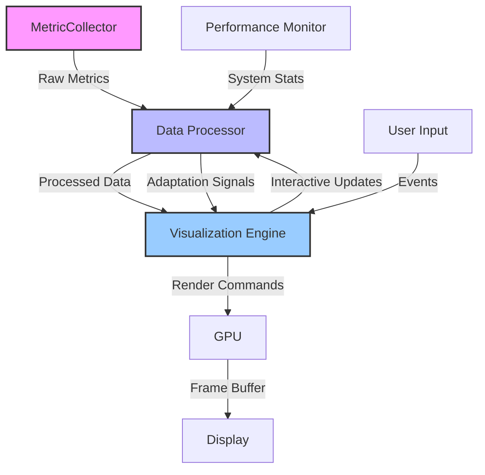

# Unified Visualization Dashboard: The Art of Temporal Visualization

> **Version**: 2.1.0  
> **Last Updated**: 2025-06-09  
> **Status**: Active  
> **Prerequisites**: 
> - [Core Concepts](../../core/01_core_concepts.md)
> - [Temporal Programming Basics](../../guides/temporal/01_temporal_basics.md)
> - [System Monitoring](../../guides/monitoring/01_monitoring_basics.md)

> **Learning Objectives**:
> 1. Understand the architecture of the Unified Visualization Dashboard
> 2. Master real-time metric collection and analysis
> 3. Implement context-aware visualization adaptations
> 4. Optimize performance for different system states
> 5. Design effective visual feedback mechanisms

## Table of Contents

1. [Introduction](#introduction)
   - [Overview](#overview)
   - [Key Features](#key-features)
   - [Use Cases](#use-cases)
2. [Architecture](#architecture)
   - [Core Components](#core-components)
   - [Data Flow](#data-flow)
   - [Performance Modes](#performance-modes)
3. [Implementation Guide](#implementation-guide)
   - [Setup and Configuration](#setup-and-configuration)
   - [Custom Visualizations](#custom-visualizations)
   - [Performance Optimization](#performance-optimization)
4. [Advanced Features](#advanced-features)
   - [Temporal Analytics](#temporal-analytics)
   - [Anomaly Detection](#anomaly-detection)
   - [Predictive Scaling](#predictive-scaling)
5. [Best Practices](#best-practices)
6. [Troubleshooting](#troubleshooting)
7. [API Reference](#api-reference)
8. [Additional Resources](#additional-resources)

## Introduction

### Overview

The 4ever Unified Visualization Dashboard is a powerful tool for real-time monitoring and visualization of temporal data and system dynamics. It provides intelligent performance management, context-aware adaptations, and comprehensive error handling to ensure optimal visualization quality across different system states and workloads.

### Key Features

- **Real-time Metrics**: Monitor system performance with millisecond precision
- **Adaptive Rendering**: Automatically adjust visualization quality based on system load
- **Temporal Analytics**: Analyze patterns and trends over time
- **Interactive Exploration**: Dive deep into temporal data with intuitive controls
- **Customizable Layouts**: Tailor the dashboard to your specific needs
- **Cross-platform Compatibility**: Works seamlessly across devices and platforms

### Use Cases

1. **System Performance Monitoring**
   - Track CPU, GPU, memory, and network usage
   - Visualize performance bottlenecks
   - Monitor application health

2. **Temporal Data Analysis**
   - Analyze time-series data
   - Detect patterns and anomalies
   - Compare multiple time periods

3. **Resource Optimization**
   - Identify resource-intensive operations
   - Optimize system performance
   - Plan capacity and scaling

## Architecture

### Core Components



### Data Flow

1. **Data Collection**
   - System metrics (CPU, GPU, memory, etc.)
   - Application-specific metrics
   - User interaction events

2. **Data Processing**
   - Normalization and aggregation
   - Temporal alignment
   - Anomaly detection

3. **Visual Encoding**
   - Mapping data to visual properties
   - Level-of-detail selection
   - Animation and transitions

4. **Rendering**
   - GPU-accelerated rendering
   - Adaptive quality settings
   - Frame rate management

### Performance Modes

The dashboard operates in several performance modes to ensure optimal performance:

| Mode | Description | Use Case |
|------|-------------|----------|
| **Interactive** | Full fidelity, low latency | User actively exploring data |
| **Animated** | Balanced quality and performance | Smooth animations and transitions |
| **Static** | High quality, reduced updates | Viewing static visualizations |
| **Lean** | Minimal rendering, maximum performance | System under heavy load |

## Implementation Guide

### Setup and Configuration

```javascript
// Example dashboard configuration
const dashboardConfig = {
  version: '2.1.0',
  metrics: {
    refreshInterval: 1000,  // ms
    historySize: 3600,      // data points to keep
    collectors: [
      'cpu',
      'memory',
      'gpu',
      'network',
      'custom.metrics'
    ]
  },
  visualization: {
    theme: 'dark',
    animations: {
      enabled: true,
      duration: 300,  // ms
      easing: 'ease-in-out'
    },
    quality: 'auto',  // auto | low | medium | high
    maxFPS: 60
  },
  performance: {
    mode: 'auto',
    thresholds: {
      cpu: 80,    // %
      gpu: 70,    // %
      memory: 75, // %
      fps: 30     // frames per second
    },
    adaptation: {
      strategy: 'progressive',  // progressive | immediate
      cooldown: 5000           // ms
    }
  }
};
```

### Custom Visualizations

Creating a custom visualization component:

```javascript
class CustomVisualization extends TemporalVisualization {
  constructor(config) {
    super({
      name: 'custom-visualization',
      version: '1.0.0',
      dependencies: ['d3', 'moment'],
      ...config
    });
    
    // Initialize state
    this.state = {
      data: [],
      viewport: { width: 0, height: 0 },
      timeRange: { start: null, end: null },
      selectedPoint: null
    };
    
    // Set up event handlers
    this.on('dataUpdate', this.handleDataUpdate.bind(this));
    this.on('resize', this.handleResize.bind(this));
    this.on('timeRangeChange', this.handleTimeRangeChange.bind(this));
  }
  
  async initialize(container) {
    // Set up DOM elements
    this.container = d3.select(container)
      .classed('custom-visualization', true);
      
    // Create SVG container
    this.svg = this.container.append('svg')
      .attr('width', '100%')
      .attr('height', '100%');
      
    // Set up scales and axes
    this.x = d3.scaleTime();
    this.y = d3.scaleLinear();
    
    // Add zoom/pan behavior
    this.zoom = d3.zoom()
      .scaleExtent([0.1, 10])
      .on('zoom', this.handleZoom.bind(this));
      
    this.svg.call(this.zoom);
    
    // Initial render
    this.updateViewport();
    this.render();
    
    return this;
  }
  
  // Event handlers and rendering methods...
  
  render() {
    // Update scales
    this.x.range([0, this.state.viewport.width])
      .domain([this.state.timeRange.start, this.state.timeRange.end]);
      
    this.y.range([this.state.viewport.height, 0])
      .domain([0, d3.max(this.state.data, d => d.value) * 1.1]);
    
    // Update visualization
    // ...
    
    return this;
  }
  
  // Clean up resources
  destroy() {
    // Remove event listeners
    this.off('dataUpdate', this.handleDataUpdate);
    this.off('resize', this.handleResize);
    this.off('timeRangeChange', this.handleTimeRangeChange);
    
    // Clean up DOM
    this.container.remove();
    
    return this;
  }
}

// Register the visualization
TemporalVisualization.register('custom-visualization', CustomVisualization);
```

### Performance Optimization

1. **Data Management**
   - Use efficient data structures (e.g., typed arrays)
   - Implement data sampling for large datasets
   - Use web workers for expensive computations

2. **Rendering Optimization**
   - Use hardware-accelerated CSS transforms
   - Implement level-of-detail rendering
   - Use canvas or WebGL for complex visualizations

3. **Memory Management**
   - Clean up unused resources
   - Implement object pooling
   - Monitor memory usage

## Advanced Features

### Temporal Analytics

Analyze patterns and trends over time with built-in statistical functions:

```javascript
// Example temporal analysis
const analysis = TemporalAnalyzer.analyze({
  data: timeSeriesData,
  metrics: [
    { type: 'trend', method: 'linear' },
    { type: 'seasonality', period: 'day' },
    { type: 'anomaly', algorithm: 'z-score', threshold: 3 }
  ],
  window: '30d',
  granularity: '1h'
});

// Visualize results
dashboard.addVisualization({
  type: 'line',
  title: 'Temporal Analysis',
  data: analysis.results,
  options: {
    showTrend: true,
    showSeasonality: true,
    highlightAnomalies: true
  }
});
```

### Anomaly Detection

Detect and visualize anomalies in time-series data:

```javascript
// Configure anomaly detection
const detector = new AnomalyDetector({
  algorithm: 'isolation-forest',
  sensitivity: 0.95,
  features: ['value', 'rate_of_change', 'variance'],
  trainingWindow: '7d'
});

// Process data stream
dataStream
  .pipe(detector.process)
  .on('anomaly', (anomaly) => {
    console.log('Anomaly detected:', anomaly);
    dashboard.notify({
      type: 'warning',
      title: 'Anomaly Detected',
      message: `Unusual value detected at ${anomaly.timestamp}`,
      data: anomaly
    });
  });
```

### Predictive Scaling

Anticipate future system loads and scale resources accordingly:

```javascript
// Configure predictive scaling
const predictor = new LoadPredictor({
  model: 'arima',
  history: '30d',
  horizon: '1h',
  interval: '5m',
  confidence: 0.9
});

// Get load predictions
const forecast = predictor.forecast();

// Visualize predictions
dashboard.addVisualization({
  type: 'area',
  title: 'Load Forecast',
  data: forecast.series,
  options: {
    showConfidence: true,
    confidenceBands: [0.8, 0.9, 0.95]
  }
});

// Scale resources based on predictions
if (forecast.peakLoad > thresholds.warning) {
  dashboard.scaleResources({
    cpu: forecast.peakLoad * 1.2,
    memory: forecast.peakMemory * 1.1
  });
}
```

## Best Practices

1. **Design Principles**
   - Keep visualizations simple and focused
   - Use consistent color schemes and scales
   - Provide context and legends
   - Support accessibility features

2. **Performance Guidelines**
   - Optimize for 60 FPS
   - Use requestAnimationFrame for animations
   - Implement progressive loading
   - Use web workers for heavy computations

3. **User Experience**
   - Provide loading indicators
   - Handle errors gracefully
   - Support keyboard navigation
   - Include tooltips and help text

## Troubleshooting

### Common Issues

1. **High CPU/GPU Usage**
   - Reduce visualization complexity
   - Increase update intervals
   - Disable unnecessary animations

2. **Memory Leaks**
   - Clean up event listeners
   - Release unused resources
   - Monitor memory usage

3. **Visual Glitches**
   - Check for race conditions
   - Verify data synchronization
   - Test on different devices

### Debugging Tools

- Built-in performance profiler
- Memory usage monitor
- Frame rate counter
- Network activity monitor

## API Reference

### Core Classes

#### Dashboard

```typescript
class Dashboard {
  // Configuration
  constructor(config: DashboardConfig);
  initialize(container: HTMLElement): Promise<void>;
  destroy(): void;
  
  // Data Management
  addDataSource(source: DataSource): string;
  removeDataSource(id: string): boolean;
  getData(query: DataQuery): Promise<DataResponse>;
  
  // Visualization Management
  addVisualization(config: VisualizationConfig): string;
  removeVisualization(id: string): boolean;
  updateVisualization(id: string, config: Partial<VisualizationConfig>): boolean;
  
  // Event Handling
  on(event: string, handler: Function): void;
  off(event: string, handler: Function): void;
  emit(event: string, ...args: any[]): void;
  
  // Performance Management
  setPerformanceMode(mode: PerformanceMode): void;
  getPerformanceMetrics(): PerformanceMetrics;
  
  // Utility Methods
  exportAsImage(options?: ExportOptions): Promise<Blob>;
  saveLayout(name: string): Promise<void>;
  loadLayout(name: string): Promise<void>;
}
```

#### DataSource

```typescript
interface DataSource {
  id: string;
  type: 'api' | 'websocket' | 'file' | 'custom';
  config: any;
  fetch(query: DataQuery): Promise<DataResponse>;
  subscribe(callback: (data: DataResponse) => void): UnsubscribeFunction;
}
```

#### Visualization

```typescript
interface VisualizationConfig {
  id?: string;
  type: string;
  title: string;
  description?: string;
  data: DataQuery | any[];
  options?: any;
  layout?: {
    x?: number;
    y?: number;
    width?: number | string;
    height?: number | string;
    minWidth?: number | string;
    minHeight?: number | string;
    maxWidth?: number | string;
    maxHeight?: number | string;
  };
  events?: {
    [eventName: string]: (event: any) => void;
  };
}
```

## Additional Resources

### Documentation
- [Getting Started Guide](../../getting_started/01_quickstart.md)
- [API Reference](../../api/visualization/README.md)
- [Custom Visualizations](../../guides/visualization/custom_visualizations.md)

### Examples
- [Basic Dashboard](../../examples/visualization/basic_dashboard/README.md)
- [Real-time Monitoring](../../examples/visualization/realtime_monitoring/README.md)
- [Temporal Analysis](../../examples/visualization/temporal_analysis/README.md)

### Community
- [4ever Visualization Forum](https://forum.4ever-lang.org/c/visualization)
- [GitHub Repository](https://github.com/4ever-lang/visualization)
- [Contribution Guidelines](../../CONTRIBUTING.md)

### Learning Resources
- [Data Visualization Best Practices](https://www.datavisualizationsociety.org/)
- [D3.js Documentation](https://d3js.org/)
- [Temporal Data Visualization](https://www.temporalvisualization.com/)

---

*Document Version: 2.1.0  
Last Updated: 2025-06-09  
© 2025 4ever Project Contributors*
