# Advanced Usage Scenarios: The Art of Temporal Application

> **Version**: 3.3.0  
> **Last Updated**: 2025-06-09  
> **Status**: Active  
> **Prerequisites**: 
> - [Core Concepts](../../core/01_core_concepts.md)
> - [Getting Started](../../getting_started/01_quickstart.md)
> - [Temporal Programming](../../guides/temporal/01_temporal_basics.md)
> - [Distributed Systems](../../guides/patterns/02_distributed_systems.md)

> **Learning Objectives**:
> 1. Master advanced temporal design patterns and their practical applications
> 2. Design and implement fault-tolerant distributed systems with 4ever
> 3. Apply temporal programming techniques across various domains
> 4. Optimize performance, reliability, and scalability of temporal applications
> 5. Implement comprehensive testing and monitoring strategies

> **Advanced Topics Covered**:
> - Temporal design patterns (Saga, CQRS, Event Sourcing)
> - Distributed consensus and consistency models
> - Performance optimization and scaling
> - Real-world case studies and best practices
> - Advanced error handling and recovery patterns

## Table of Contents

1. [Temporal Design Patterns](#temporal-design-patterns)
   - [Saga Pattern](#saga-pattern)
   - [Event Sourcing](#event-sourcing)
   - [CQRS (Command Query Responsibility Segregation)](#cqrs)
   - [Temporal Workflows](#temporal-workflows)
   - [Compensating Transactions](#compensating-transactions)

2. [Distributed Systems](#distributed-systems)
   - [Consensus Protocols](#consensus-protocols)
   - [Conflict Resolution](#conflict-resolution)
   - [Distributed Transactions](#distributed-transactions)
   - [Consistency Models](#consistency-models)
   - [Leader Election](#leader-election)

3. [Real-world Applications](#real-world-applications)
   - [Financial Systems](#financial-systems)
   - [Scientific Computing](#scientific-computing)
   - [Supply Chain Management](#supply-chain-management)
   - [Healthcare Systems](#healthcare-systems)
   - [IoT and Edge Computing](#iot-and-edge-computing)

4. [Implementation Guide](#implementation-guide)
   - [Code Examples](#code-examples)
   - [Best Practices](#best-practices)
   - [Performance Optimization](#performance-optimization)
   - [Error Handling and Recovery](#error-handling-and-recovery)
   - [Testing Strategies](#testing-strategies)

5. [Case Studies](#case-studies)
   - [Global Payment Network](#global-payment-network)
   - [Scientific Research Platform](#scientific-research-platform)
   - [E-commerce Order Fulfillment](#e-commerce-order-fulfillment)
   - [Healthcare Data Processing](#healthcare-data-processing)
   - [Autonomous Vehicle Coordination](#autonomous-vehicle-coordination)

6. [Additional Resources](#additional-resources)
   - [Documentation](#documentation)
   - [Tools and Libraries](#tools-and-libraries)
   - [Community](#community)
   - [Learning Resources](#learning-resources)

## Table of Contents

1. [Temporal Design Patterns](#temporal-design-patterns)
   - [Saga Pattern](#saga-pattern)
   - [Event Sourcing](#event-sourcing)
2. [Distributed Systems](#distributed-systems)
   - [Consensus Protocols](#consensus-protocols)
   - [Conflict Resolution](#conflict-resolution)
3. [Real-world Applications](#real-world-applications)
   - [Financial Systems](#financial-systems)
   - [Scientific Computing](#scientific-computing)
4. [Implementation Guide](#implementation-guide)
   - [Code Examples](#code-examples)
   - [Best Practices](#best-practices)
5. [Case Studies](#case-studies)
6. [Additional Resources](#additional-resources)

## Temporal Design Patterns

### Saga Pattern

Implement long-running transactions with compensation:

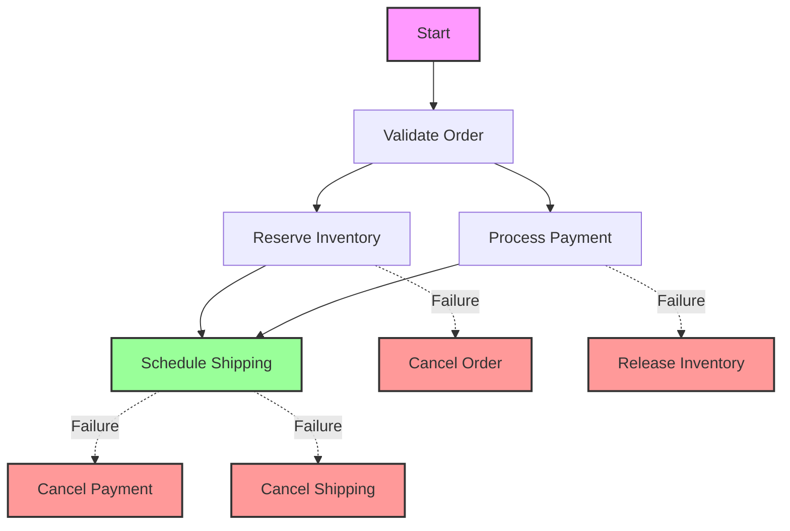

### Event Sourcing

Capture all changes to application state as a sequence of events:

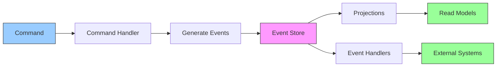

### CQRS (Command Query Responsibility Segregation)

Separate read and write operations for better scalability:

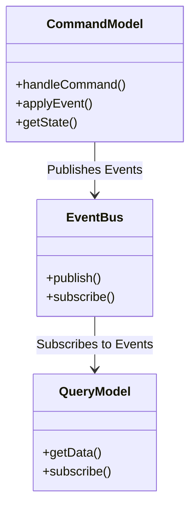

## Implementation Patterns

### Circuit Breaker

```4ever
temporal_program {
    name: "CircuitBreaker";
    type: resilience_pattern;
    
    state: {
        state: 'closed',  // 'closed', 'open', or 'half-open'
        failure_count: 0,
        last_failure: null,
        reset_timeout: 5000  // ms
    };
    
    // Execute a function with circuit breaker protection
    execute: async |fn, ...args| {
        if (this.state.state === 'open') {
            const now = Date.now();
            if (now - this.state.last_failure > this.state.reset_timeout) {
                this.state.state = 'half-open';
            } else {
                throw new Error('Circuit breaker is open');
            }
        }
        
        try {
            const result = await fn(...args);
            this.record_success();
            return result;
        } catch (error) {
            this.record_failure();
            throw error;
        }
    };
    
    record_success: | | {
        if (this.state.state === 'half-open') {
            this.state.state = 'closed';
            this.state.failure_count = 0;
        }
    };
    
    record_failure: | | {
        this.state.failure_count++;
        this.state.last_failure = Date.now();
        
        if (this.state.failure_count >= this.config.failure_threshold) {
            this.state.state = 'open';
            setTimeout(() => {
                this.state.state = 'half-open';
            }, this.state.reset_timeout);
        }
    };
}
```

### Retry with Exponential Backoff

```4ever
temporal_program {
    name: "RetryWithBackoff";
    type: resilience_pattern;
    
    config: {
        max_retries: 5,
        initial_delay: 100,  // ms
        max_delay: 10000,    // ms
        factor: 2,
        jitter: 0.1
    };
    
    // Execute a function with retry logic
    execute: async |fn, ...args| {
        let attempt = 0;
        let last_error = null;
        
        while (attempt <= this.config.max_retries) {
            try {
                return await fn(...args);
            } catch (error) {
                last_error = error;
                
                if (attempt === this.config.max_retries) {
                    break;
                }
                
                // Calculate delay with exponential backoff and jitter
                const delay = Math.min(
                    this.config.initial_delay * Math.pow(this.config.factor, attempt),
                    this.config.max_delay
                );
                
                // Add jitter
                const jitter = delay * this.config.jitter * (Math.random() * 2 - 1);
                const wait_time = delay + jitter;
                
                await new Promise(resolve => setTimeout(resolve, wait_time));
                attempt++;
            }
        }
        
        throw last_error;
    };
}
```

## Best Practices

### Saga Implementation Best Practices

1. **Idempotency**
   - Ensure all operations can be safely retried
   - Use unique request IDs for idempotency
   
2. **Compensation**
   - Always provide compensating transactions
   - Make compensations idempotent
   - Consider eventual consistency in compensation logic

3. **Monitoring**
   - Track saga execution state
   - Log all state transitions
   - Set up alerts for stuck sagas

4. **Testing**
   - Test all failure scenarios
   - Verify compensation logic
   - Test network partitions and timeouts

### Event Sourcing Best Practices

1. **Event Design**
   - Use past tense for event names (e.g., `OrderPlaced`)
   - Include all necessary data in events
   - Version your events

2. **Projections**
   - Keep projections simple and focused
   - Handle out-of-order events
   - Implement projection rebuilds

3. **Performance**
   - Use snapshots for large aggregates
   - Consider event upcasting
   - Optimize event store queries

### CQRS Best Practices

1. **Consistency**
   - Choose appropriate consistency models
   - Handle eventual consistency
   - Implement read-after-write consistency when needed

2. **Scaling**
   - Scale read and write sides independently
   - Consider caching strategies
   - Monitor query performance

3. **Complexity Management**
   - Start simple, only add CQRS when needed
   - Document the data flow
   - Implement comprehensive monitoring

## Anti-patterns to Avoid

1. **Saga Anti-patterns**
   - Long-running locks
   - Nested sagas without proper error handling
   - Insufficient logging for debugging
   - Incomplete compensation logic

2. **Event Sourcing Anti-patterns**
   - Storing sensitive data in events
   - Using events as a message queue
   - Not planning for schema evolution

3. **CQRS Anti-patterns**
```4ever
temporal_program {
    name: "Trading Strategy";
    type: financial_trading;
    consistency: strong;
    max_latency: "50μs";
    
    on_market_data: |update| {
        let signal = analyze(update);
        if (should_trade(signal)) {
            execute_trade(signal)
                .with_deadline("100μs");
        }
    }
    
    // Define saga steps
    steps: [
        {
            name: "validate_order",
            action: this.validate_order,
            compensate: this.compensate_validation,
            retry_policy: {
                max_attempts: 3,
                backoff: 'exponential',
                initial_delay: '1s'
            }
        },
        {
            name: "reserve_inventory",
            action: this.reserve_inventory,
            compensate: this.compensate_inventory,
            requires: ["validate_order"]
        },
        {
            name: "process_payment",
            action: this.process_payment,
            compensate: this.refund_payment,
            requires: ["validate_order"]
        },
        {
            name: "schedule_shipping",
            action: this.schedule_shipping,
            requires: ["reserve_inventory", "process_payment"],
            async: true
        }
    ];
    
    // Initialize saga
    initialize: |ctx| {
        this.state = {
            order_id: ctx.order_id,
            current_step: null,
            completed_steps: new Set(),
            compensation_stack: [],
            state_store: {}
        };
        
        // Set up event listeners
        this.on('step_started', this.log_step_start);
        this.on('step_completed', this.log_step_completion);
        this.on('step_failed', this.handle_step_failure);
        this.on('compensation_started', this.log_compensation_start);
        this.on('compensation_completed', this.log_compensation_completion);
    };
    
    // Execute the saga
    execute: async |ctx| {
        try {
            // Process each step in order
            for (const step of this.get_execution_order()) {
                this.state.current_step = step.name;
                this.emit('step_started', step);
                
                // Check if step requirements are met
                if (!this.are_requirements_met(step)) {
                    throw new Error(`Requirements not met for step: ${step.name}`);
                }
                
                // Execute step with retry logic
                await this.retry_operation(
                    () => step.action(ctx),
                    step.retry_policy
                );
                
                // Update state
                this.state.completed_steps.add(step.name);
                if (step.compensate) {
                    this.state.compensation_stack.push(step.name);
                }
                
                this.emit('step_completed', step);
            }
            
            return { success: true, message: 'Saga completed successfully' };
            
        } catch (error) {
            // Start compensation flow
            this.emit('saga_failed', { 
                step: this.state.current_step, 
                error: error.message 
            });
            
            await this.compensate(error);
            
            return { 
                success: false, 
                error: error.message,
                compensated: true
            };
        }
    };
    
    // Execute compensation steps
    compensate: async |error| {
        this.emit('compensation_started', { 
            step: this.state.current_step,
            error: error.message
        });
        
        // Execute compensations in reverse order
        while (this.state.compensation_stack.length > 0) {
            const step_name = this.state.compensation_stack.pop();
            const step = this.steps.find(s => s.name === step_name);
            
            if (step && step.compensate) {
                try {
                    this.emit('compensating_step', { step: step_name });
                    await step.compensate({
                        saga_state: this.state.state_store,
                        original_error: error
                    });
                    this.emit('step_compensated', { step: step_name });
                } catch (comp_error) {
                    // Log but continue with other compensations
                    this.emit('compensation_failed', {
                        step: step_name,
                        error: comp_error.message
                    });
                }
            }
        }
        
        this.emit('compensation_completed', {
            success: this.state.compensation_stack.length === 0
        });
    };
    
    // Additional helper methods...
}
```

## Distributed Systems

### Consensus Protocols

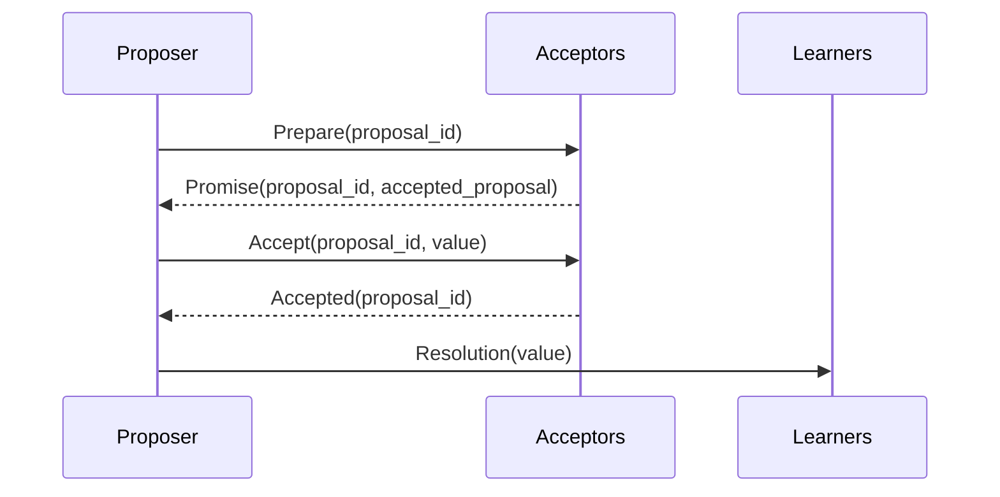

### Raft Consensus Implementation

```4ever
temporal_program {
    name: "RaftConsensus";
    type: consensus_protocol;
    
    state: {
        current_term: 0,
        voted_for: null,
        log: [],
        commit_index: 0,
        last_applied: 0,
        state: 'follower',  // 'follower', 'candidate', 'leader'
        election_timeout: 150 + Math.random() * 150,  // ms
        last_heartbeat: Date.now(),
        peers: []
    };
    
    config: {
        heartbeat_interval: 50,  // ms
        election_timeout_min: 150,  // ms
        election_timeout_max: 300,  // ms
        max_entries_per_request: 1000
    };
    
    // Initialize Raft node
    initialize: |peers, node_id| {
        this.state.node_id = node_id || `node-${Math.random().toString(36).substr(2, 9)}`;
        this.state.peers = peers.filter(peer => peer !== this.state.node_id);
        this.reset_election_timeout();
        this.setup_network_handlers();
        this.start_election_timer();
    };
    
    // Start election timer
    start_election_timer: | | {
        if (this.election_timer) clearTimeout(this.election_timer);
        
        this.election_timer = setTimeout(() => {
            if (this.state.state !== 'leader') {
                this.start_election();
            }
        }, this.state.election_timeout);
    };
    
    // Start a new leader election
    start_election: | | {
        this.state.state = 'candidate';
        this.state.current_term++;
        this.state.voted_for = this.state.node_id;
        this.state.vote_count = 1;  // Vote for self
        
        // Reset election timeout
        this.reset_election_timeout();
        
        // Request votes from other nodes
        const request = {
            type: 'RequestVote',
            term: this.state.current_term,
            candidate_id: this.state.node_id,
            last_log_index: this.state.log.length - 1,
            last_log_term: this.state.log.length > 0 ? 
                this.state.log[this.state.log.length - 1].term : 0
        };
        
        // Send vote requests to all peers
        this.state.peers.forEach(peer => {
            this.send_rpc(peer, request, (response) => {
                this.handle_vote_response(peer, response);
            });
        });
        
        // Restart election timer
        this.start_election_timer();
    };
    
    // Handle incoming RPCs
    handle_rpc: |message| {
        if (message.term > this.state.current_term) {
            this.step_down(message.term);
        }
        
        switch (message.type) {
            case 'AppendEntries':
                return this.handle_append_entries(message);
            case 'RequestVote':
                return this.handle_request_vote(message);
            case 'InstallSnapshot':
                return this.handle_install_snapshot(message);
            default:
                throw new Error(`Unknown RPC type: ${message.type}`);
        }
    };
    
    // Handle AppendEntries RPC
    handle_append_entries: |message| {
        // Implementation of AppendEntries RPC handler
        // ...
    };
    
    // Handle RequestVote RPC
    handle_request_vote: |message| {
        // Implementation of RequestVote RPC handler
        // ...
    };
    
    // Handle InstallSnapshot RPC
    handle_install_snapshot: |message| {
        // Implementation of InstallSnapshot RPC handler
        // ...
    };
    
    // Apply committed entries to state machine
    apply_committed_entries: | | {
        while (this.state.last_applied < this.state.commit_index) {
            this.state.last_applied++;
            const entry = this.state.log[this.state.last_applied];
            this.state_machine.apply(entry.command);
        }
    };
    
    // Reset election timeout
    reset_election_timeout: | | {
        this.state.election_timeout = 
            this.config.election_timeout_min + 
            Math.random() * (this.config.election_timeout_max - this.config.election_timeout_min);
    };
    
    // Step down to follower state
    step_down: |new_term| {
        this.state.state = 'follower';
        this.state.current_term = new_term;
        this.state.voted_for = null;
        this.reset_election_timeout();
    };
    
    // Start the Raft node
    start: | | {
        console.log(`[${this.state.node_id}] Starting Raft node`);
        this.start_election_timer();
    };
}

## Distributed Transactions

### Two-Phase Commit (2PC)

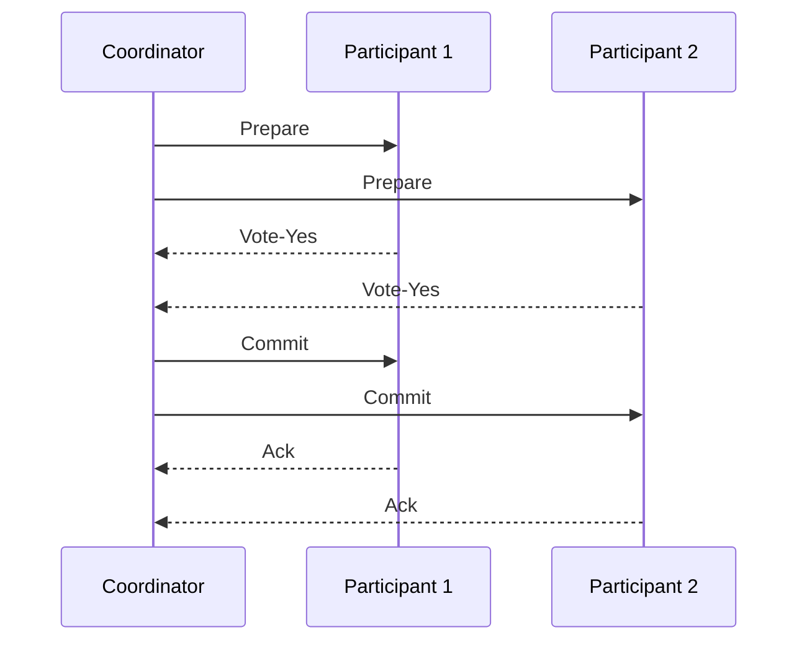

### Saga Pattern for Distributed Transactions

```4ever
temporal_program {
    name: "DistributedOrderSaga";
    type: distributed_transaction;
    
    steps: [
        {
            name: "validate_order",
            action: this.validate_order,
            compensate: this.reject_order,
            retry_policy: { max_attempts: 3, backoff: 'exponential' }
        },
        {
            name: "reserve_inventory",
            action: this.reserve_inventory,
            compensate: this.release_inventory,
            requires: ["validate_order"]
        },
        {
            name: "process_payment",
            action: this.process_payment,
            compensate: this.refund_payment,
            requires: ["validate_order"],
            timeout: "30s"
        },
        {
            name: "schedule_shipping",
            action: this.schedule_shipping,
            requires: ["reserve_inventory", "process_payment"],
            async: true
        }
    ];
    
    // Implementation of action and compensation methods
    // ...
}

## Consistency Models

### Strong Consistency

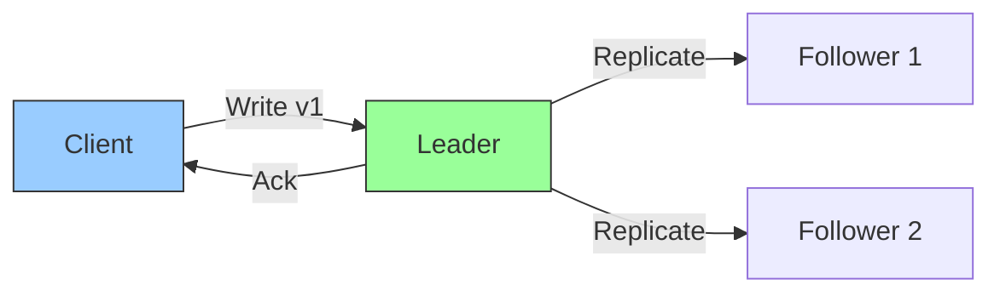

### Eventual Consistency

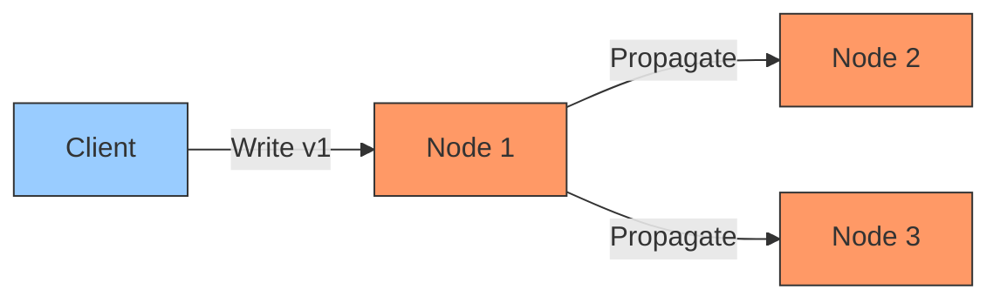

## Best Practices for Distributed Systems

1. **Fault Tolerance**
   - Design for partial failures
   - Implement circuit breakers and bulkheads
   - Use retries with exponential backoff

2. **Consistency Trade-offs**
   - Choose appropriate consistency levels
   - Understand CAP theorem implications
   - Implement conflict resolution strategies

3. **Monitoring and Observability**
   - Distributed tracing
   - Metrics collection and alerting
   - Structured logging with correlation IDs

4. **Testing**
   - Chaos engineering
   - Network partition testing
   - Failure injection

## Anti-patterns in Distributed Systems

1. **Distributed Monolith**
   - Tight coupling between services
   - Shared database anti-pattern
   - Lack of service boundaries

2. **Cascading Failures**
   - No circuit breakers
   - No rate limiting
   - No proper timeouts

3. **Inconsistent State**
   - Missing idempotency keys
   - No compensation logic
   - Incomplete transactions

## Performance Optimization

### Read/Write Quorum

```mermaid
classDiagram
    class QuorumSystem {
        +nodes: Node[]
        +write_quorum_size: number
        +read_quorum_size: number
        +write(value) : boolean
        +read() : any
    }
    
    QuorumSystem --> Node : contains
    
    class Node {
        +id: string
        +data: any
        +version: number
        +write(value, version) : boolean
        +read() : {value, version}
    }
```

### Sharding Strategies

```4ever
temporal_program {
    name: "ShardManager";
    type: data_sharding;
    
    config: {
        shard_count: 10,
        replication_factor: 3,
        rebalance_threshold: 0.2  // 20% imbalance triggers rebalancing
    };
    
    state: {
        shards: [],
        nodes: [],
        key_ranges: {}
    };
    
    // Initialize shard manager
    initialize: |nodes| {
        this.state.nodes = nodes;
        this.initialize_shards();
        this.rebalance_shards();
    };
    
    // Get shard for a key
    get_shard: |key| {
        const hash = this.hash_key(key);
        const shard_index = hash % this.state.shards.length;
        return this.state.shards[shard_index];
    };
    
    // Add a new node to the cluster
    add_node: |node| {
        this.state.nodes.push(node);
        this.rebalance_shards();
    };
    
    // Remove a node from the cluster
    remove_node: |node_id| {
        this.state.nodes = this.state.nodes.filter(node => node.id !== node_id);
        this.rebalance_shards();
    };
    
    // Rebalance shards across nodes
    rebalance_shards: | | {
        // Implementation of shard rebalancing
        // ...
    };
    
    // Consistent hashing for key distribution
    hash_key: |key| {
        // Implementation of consistent hashing
        // ...
    };
    
    // Monitor shard distribution
    monitor_distribution: | | {
        // Implementation of shard distribution monitoring
        // ...
    };
}

## Security Considerations

1. **Authentication & Authorization**
   - Mutual TLS for service-to-service communication
   - JWT for stateless authentication
   - Role-based access control (RBAC)

2. **Data Protection**
   - Encryption at rest and in transit
   - Data masking and redaction
   - Secure secret management

3. **Audit Logging**
   - Comprehensive audit trails
   - Immutable logging
   - Real-time monitoring for suspicious activities

4. **Compliance**
   - GDPR, HIPAA, SOC 2 compliance
   - Data residency requirements
   - Regular security audits

temporal_program {
    name: "TemporalPaxos";
    type: consensus_protocol;
    
    resources: {
        chronon: 15000,
        aethel: 8000
    };
    
    // Consensus configuration
    config: {
        quorum_size: (n) => Math.floor(n / 2) + 1,
        election_timeout: '2s',
        heartbeat_interval: '500ms',
        max_retries: 5,
        log_replication: {
            batch_size: 1000,
            sync_interval: '100ms',
            snapshot_interval: 10000 // entries
        }
    };
    
    // Initialize consensus module
    initialize: |ctx| {
        // Node state
        this.state = {
            current_term: 0,
            voted_for: null,
            log: [],
            commit_index: 0,
            last_applied: 0,
            
            // Volatile state
            role: 'follower', // follower, candidate, leader
            leader_id: null,
            votes_received: new Set(),
            
            // For leaders
            next_index: new Map(),
            match_index: new Map(),
            
            // Cluster membership
            nodes: new Set([this.node_id]),
            configuration: {
                current: [],
                next: null
            }
        };
        
        // Initialize RPC handlers
        this.rpc = new RPC_Server({
            request_vote: this.handle_request_vote,
            append_entries: this.handle_append_entries,
            install_snapshot: this.handle_install_snapshot,
            timeout_now: this.handle_timeout_now
        });
        
        // Start election timer
        this.reset_election_timer();
        
        // Start log compaction worker
        this.log_compaction_worker = setInterval(
            () => this.compact_log_if_needed(),
            60000 // Check every minute
        );
    };
    
    // Handle client requests
    handle_client_request: |request| {
        if (this.state.role !== 'leader') {
            if (this.state.leader_id) {
                // Redirect to leader
                return this.redirect_to_leader(request);
            }
            throw new Error('No leader available');
        }
        
        // Append to local log
        const entry = this.create_log_entry(request);
        this.state.log.push(entry);
        
        // Replicate to followers
        return this.replicate_log()
            .then(() => {
                // Apply to state machine once committed
                this.apply_committed_entries();
                return { success: true, index: entry.index };
            });
    };
    
    // Replicate log entries to followers
    replicate_log: async |options = {}| {
        if (this.state.role !== 'leader') return;
        
        const replication_results = [];
        const config = { ...this.config, ...options };
        
        for (const node_id of this.state.nodes) {
            if (node_id === this.node_id) continue;
            
            const next_idx = this.state.next_index.get(node_id) || 1;
            const prev_log_idx = next_idx - 1;
            const prev_log_term = this.get_log_term(prev_log_idx);
            
            const entries = this.state.log.slice(prev_log_idx);
            
            // Prepare AppendEntries RPC
            const rpc = {
                term: this.state.current_term,
                leader_id: this.node_id,
                prev_log_index: prev_log_idx,
                prev_log_term: prev_log_term,
                entries: entries,
                leader_commit: this.state.commit_index
            };
            
            try {
                const result = await this.rpc.call(node_id, 'append_entries', rpc, {
                    timeout: config.election_timeout
                });
                
                if (result.success) {
                    // Update next_index and match_index for follower
                    if (entries.length > 0) {
                        const last_idx = entries[entries.length - 1].index;
                        this.state.next_index.set(node_id, last_idx + 1);
                        this.state.match_index.set(node_id, last_idx);
                    }
                    replication_results.push({ node_id, success: true });
                } else {
                    // Decrement next_index and retry
                    if (result.term > this.state.current_term) {
                        this.step_down(result.term);
                        break;
                    }
                    this.state.next_index.set(node_id, Math.max(1, next_idx - 1));
                    replication_results.push({ node_id, success: false, conflict: true });
                }
            } catch (error) {
                console.error(`Failed to replicate to ${node_id}:`, error);
                replication_results.push({ node_id, success: false, error: error.message });
            }
        }
        
        // Update commit index if we have a quorum
        this.update_commit_index();
        
        return replication_results;
    };
    
    // Additional consensus methods...
}
    initialize: |market_data_feed, execution_venue| {
        this.market_data = market_data_feed;
        this.market_data.on('update', this.handle_market_data.bind(this));
        this.risk_engine = new RiskEngine(this.config);
        this.execution = new SmartOrderRouter({
            venues: this.config.allowed_venues,
            latency_budget: 50,  // microseconds
            smart_routing: true
        });
        
        // Initialize metrics calculator
        this.metrics = new TradingMetrics({
            risk_free_rate: this.config.risk_free_rate,
            lookback: this.config.lookback_period
        });
    };
    
    // Handle incoming market data
    handle_market_data: |data| {
        // Update order book
        this.update_order_book(data);
        
        // Generate trading signals
        const signals = this.generate_signals();
        
        // Check risk limits before execution
        if (this.risk_engine.check_limits({
            positions: this.state.positions,
            pnl: this.state.pnl,
            signals: signals
        })) {
            // Execute trades
            this.execute_trades(signals);
        } else {
            console.warn('Risk limits exceeded, not executing trades');
        }
    };
    
    // Generate trading signals
    generate_signals: | | {
        // Implement signal generation logic
        const signals = [];
        
        // Example: Simple moving average crossover
        const short_ma = this.calculate_moving_average(10);
        const long_ma = this.calculate_moving_average(50);
        
        if (short_ma > long_ma * 1.001) {
            signals.push({
                symbol: this.market_data.symbol,
                side: 'BUY',
                quantity: this.calculate_position_size(),
                price: this.state.order_book.asks[0].price,
                strategy: 'MA_Crossover',
                timestamp: Date.now()
            });
        } else if (short_ma < long_ma * 0.999) {
            signals.push({
                symbol: this.market_data.symbol,
                side: 'SELL',
                quantity: this.calculate_position_size(),
                price: this.state.order_book.bids[0].price,
                strategy: 'MA_Crossover',
                timestamp: Date.now()
            });
        }
        
        return signals;
    };
    
    // Execute trades with smart order routing
    execute_trades: |signals| {
        for (const signal of signals) {
            const order = {
                symbol: signal.symbol,
                side: signal.side,
                price: signal.price,
                quantity: Math.min(signal.quantity, this.config.max_order_size),
                strategy: signal.strategy,
                timestamp: Date.now(),
                time_in_force: 'IOC',  // Immediate or Cancel
                routing: {
                    priority: 'latency',
                    avoid_odd_lots: true,
                    dark_pool_allowed: true
                }
            };
            
            // Route order to best execution venue
            this.execution.route_order(order)
                .then(execution => this.handle_execution(execution))
                .catch(error => this.handle_error(error));
        }
    };
    
    // Handle order execution
    handle_execution: |execution| {
        // Update positions and P&L
        this.update_positions(execution);
        this.calculate_pnl();
        
        // Update risk metrics
        this.update_risk_metrics(execution);
        
        // Log execution
        this.emit('execution', execution);
    };
    
    // Update positions
    update_positions: |execution| {
        const { symbol, side, quantity, price, fees } = execution;
        let position = this.state.positions[symbol] || { 
            qty: 0, 
            cost: 0,
            entry_price: 0,
            realized_pnl: 0,
            unrealized_pnl: 0
        };
        
        const prev_qty = position.qty;
        const prev_cost = position.cost * position.qty;
        
        if (side === 'BUY') {
            const total_cost = prev_cost + (quantity * price) + (fees || 0);
            position.qty += quantity;
            position.cost = position.qty > 0 ? total_cost / position.qty : 0;
            position.entry_price = position.cost;
        } else {
            const pnl = (quantity * price) - (quantity * position.entry_price) - (fees || 0);
            position.realized_pnl += pnl;
            position.qty -= quantity;
            
            if (position.qty === 0) {
                position.cost = 0;
                position.entry_price = 0;
            }
        }
        
        // Update unrealized P&L
        if (position.qty !== 0) {
            const mark_price = side === 'BUY' ? 
                this.state.order_book.bids[0].price : 
                this.state.order_book.asks[0].price;
            position.unrealized_pnl = (mark_price - position.entry_price) * position.qty;
        } else {
            position.unrealized_pnl = 0;
        }
        
        this.state.positions[symbol] = position;
    };
    
    // Calculate P&L
    calculate_pnl: | | {
        let total_pnl = 0;
        
        for (const symbol in this.state.positions) {
            const position = this.state.positions[symbol];
            total_pnl += position.realized_pnl + position.unrealized_pnl;
        }
        
        this.state.pnl = total_pnl;
        return total_pnl;
    };
    
    // Update risk metrics
    update_risk_metrics: |execution| {
        // Update daily P&L
        const now = new Date();
        const today = new Date(now.getFullYear(), now.getMonth(), now.getDate());
        
        if (!this.state.risk_metrics.last_update || 
            new Date(this.state.risk_metrics.last_update) < today) {
            // New trading day
            this.state.risk_metrics.daily_pnl = 0;
        }
        
        this.state.risk_metrics.daily_pnl += execution.realized_pnl || 0;
        this.state.risk_metrics.last_update = now;
        
        // Update max drawdown
        const current_drawdown = this.calculate_drawdown();
        this.state.risk_metrics.max_drawdown = Math.min(
            this.state.risk_metrics.max_drawdown,
            current_drawdown
        );
        
        // Update Sharpe ratio
        this.state.risk_etrics.sharpe_ratio = this.calculate_sharpe_ratio();
    };
    
    // Calculate current drawdown
    calculate_drawdown: | | {
        // Implementation of drawdown calculation
        // ...
    };
    
    // Calculate Sharpe ratio
    calculate_sharpe_ratio: | | {
        // Implementation of Sharpe ratio calculation
        // ...
    };
    
    // Calculate position size based on risk parameters
    calculate_position_size: | | {
        // Implementation of position sizing logic
        // ...
    };
    
    // Calculate moving average
    calculate_moving_average: |period| {
        // Implementation of moving average calculation
        // ...
    };
    
    // Handle errors
    handle_error: |error| {
        console.error('Trading error:', error);
        this.emit('error', error);
        
        // Implement error recovery logic
        if (error.isCritical) {
            this.emergency_shutdown();
        }
    };
    
    // Emergency shutdown procedure
    emergency_shutdown: | | {
        console.warn('Initiating emergency shutdown');
        
        // Cancel all open orders
        this.execution.cancel_all_orders()
            .then(() => {
                // Close all positions
                return this.close_all_positions();
            })
            .then(() => {
                console.log('Emergency shutdown complete');
                this.emit('shutdown');
            })
            .catch(err => {
                console.error('Error during shutdown:', err);
                this.emit('shutdown_error', err);
            });
    };
    
    // Close all open positions
    close_all_positions: | | {
        const close_orders = [];
        
        for (const symbol in this.state.positions) {
            const position = this.state.positions[symbol];
            if (position.qty !== 0) {
                close_orders.push({
                    symbol,
                    side: position.qty > 0 ? 'SELL' : 'BUY',
                    quantity: Math.abs(position.qty),
                    time_in_force: 'IOC',
                    close_position: true
                });
            }
        }
        
        return Promise.all(close_orders.map(order => 
            this.execution.route_order(order)
        ));
    };
}
```

### Scientific Computing

#### Distributed Data Processing

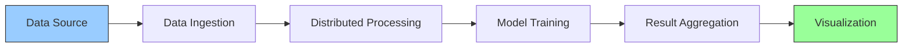

**Key Components**:
1. **Data Ingestion**
   - Batch and stream processing
   - Data validation and cleaning
   - Schema management

2. **Distributed Processing**
   - MapReduce patterns
   - Data partitioning
   - Fault tolerance

3. **Model Training**
   - Distributed machine learning
   - Hyperparameter optimization
   - Model validation

4. **Result Analysis**
   - Statistical analysis
   - Visualization
   - Reporting

### Supply Chain Management

#### End-to-End Traceability

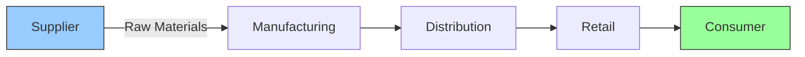

**Key Features**:
1. **Asset Tracking**
   - RFID/NFC integration
   - Real-time location tracking
   - Condition monitoring

2. **Smart Contracts**
   - Automated payments
   - Quality verification
   - Dispute resolution

3. **Analytics**
   - Demand forecasting
   - Route optimization
   - Inventory management

### Healthcare Systems

#### Patient Data Processing

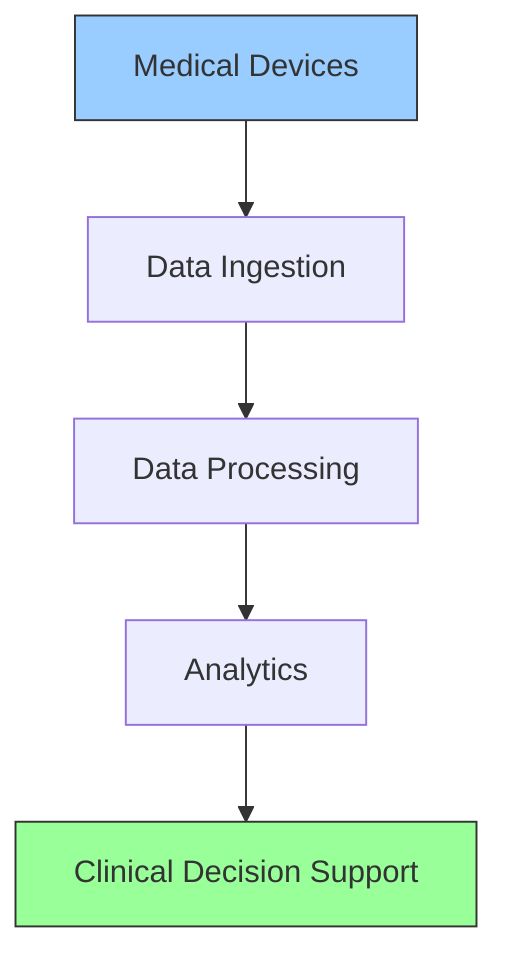

**Key Components**:
1. **Data Collection**
   - Real-time vital signs monitoring
   - Medical device integration
   - Patient history aggregation

2. **Data Processing**
   - Anomaly detection
   - Trend analysis
   - Alert generation

3. **Clinical Decision Support**
   - Evidence-based recommendations
   - Treatment effectiveness tracking
   - Risk assessment

4. **Compliance & Security**
   - HIPAA compliance
   - Audit logging
   - Access control

**4ever Implementation Benefits**:
- Real-time processing of time-series medical data
- Built-in support for temporal queries
- Secure handling of sensitive health information

**Key Components**:
1. **Data Collection**
   - HL7/FHIR integration
   - Medical device connectivity
   - Patient-generated data

2. **Data Processing**
   - Anomaly detection
   - Feature extraction
   - Data normalization

3. **Analytics**
   - Predictive modeling
   - Risk stratification
   - Treatment effectiveness

### IoT and Edge Computing

#### Smart City Infrastructure

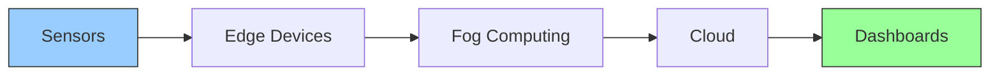

**Key Applications**:
1. **Traffic Management**
   - Adaptive signal control
   - Congestion prediction
   - Emergency vehicle routing

2. **Energy Optimization**
   - Smart grid management
   - Demand response
   - Renewable integration

3. **Public Safety**
   - Gunshot detection
   - Crowd monitoring
   - Emergency response

### Code Examples

1. **Event Sourcing with CQRS**

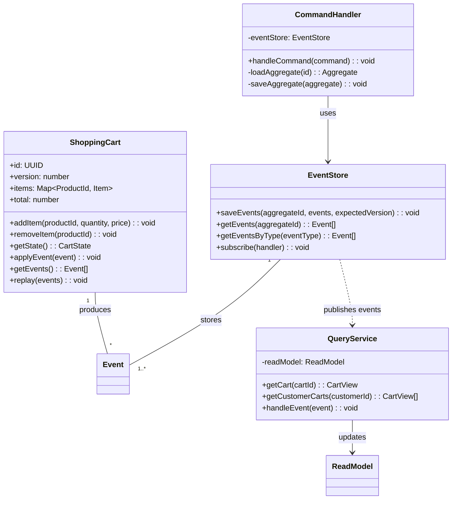

**Key Components**:
- **Aggregates**: Consistency boundaries that process commands and emit events
- **Event Store**: Append-only storage for all domain events
- **Command Handlers**: Process commands and generate events
- **Projections**: Transform events into read models
- **Subscribers**: React to events and update read models

**Implementation Patterns**:
1. **Event Sourcing**
   - Store all state changes as a sequence of events
   - Rebuild state by replaying events
   - Support for time-travel debugging

2. **CQRS**
   - Separate read and write models
   - Optimized read models for different use cases
   - Eventual consistency between read and write models

3. **Projections**
   - Materialized views of event streams
   - Can be rebuilt from the event log
   - Support for multiple representations of the same data

4. **Event Handlers**
   - Process events asynchronously
   - Can trigger additional commands
   - Support for sagas and process managers

**Performance Considerations**:
- **Snapshotting**: Store aggregate state at version N to avoid replaying all events
- **Caching**: Cache frequently accessed read models
- **Batching**: Process events in batches for better throughput
- **Sharding**: Distribute aggregates across multiple nodes

**Testing Strategy**:
1. **Unit Tests**: Test aggregate behavior using event replay
2. **Integration Tests**: Verify event store interactions
3. **End-to-End Tests**: Test complete command/query flow
4. **Performance Tests**: Verify system behavior under load

**Example Test Case**:
```4ever
temporal_test "Shopping Cart Operations" {
    setup: |ctx| {
        this.cart = new ShoppingCart(ctx.cartId);
        this.eventStore = new InMemoryEventStore();
        this.handler = new CommandHandler(this.eventStore);
    };
    
    test_cases: [
        {
            name: "Add item to cart",
            action: |test| {
                const command = new AddItemCommand(
                    test.cart.id,
                    new ProductId("prod-123"),
                    2,
                    29.99
                );
                return test.handler.handle(command);
            },
            assertions: |result, test| {
                const events = test.eventStore.getEvents(test.cart.id);
                assert.lengthOf(events, 1);
                assert.instanceOf(events[0], ItemAdded);
                
                const cart = ShoppingCart.replay(events);
                assert.equal(cart.items.size, 1);
                assert.equal(cart.total, 59.98);
            }
        },
        {
            name: "Remove item from cart",
            setup: |test| {
                // Initialize with existing items
                test.eventStore.saveEvents(test.cart.id, [
                    new ItemAdded(
                        test.cart.id,
                        new ProductId("prod-123"),
                        2,
                        29.99
                    )
                ]);
            },
            action: |test| {
                const command = new RemoveItemCommand(
                    test.cart.id,
                    new ProductId("prod-123")
                );
                return test.handler.handle(command);
            },
            assertions: |result, test| {
                const events = test.eventStore.getEvents(test.cart.id);
                assert.lengthOf(events, 2);
                assert.instanceOf(events[1], ItemRemoved);
                
                const cart = ShoppingCart.replay(events);
                assert.equal(cart.items.size, 0);
                assert.equal(cart.total, 0);
            }
        }
    ];
}
```

**Error Handling**:
- **Concurrency Conflicts**: Use optimistic concurrency control with versioning
- **Invalid Commands**: Validate commands before processing
- **Temporary Failures**: Implement retry with exponential backoff
- **Permanent Failures**: Move failed commands to a dead letter queue

**Monitoring and Observability**:
- Track command processing latency
- Monitor event store growth
- Alert on command failures
- Trace requests across service boundaries

**Scaling Considerations**:
- **Read Scaling**: Add more read replicas for read-heavy workloads
- **Write Scaling**: Shard aggregates by ID
- **Event Processing**: Use consumer groups for parallel event processing
- **Caching**: Cache frequently accessed aggregates and read models

**Migration Strategy**:
1. Start with event-sourced aggregates
2. Add CQRS for complex read requirements
3. Introduce event handlers for cross-aggregate coordination
4. Gradually migrate from CRUD to event sourcing

**Common Pitfalls**:
1. **Event Versioning**: Plan for schema evolution
2. **Performance**: Be mindful of event replay time for large aggregates
3. **Debugging**: Include correlation IDs in events
4. **Testing**: Test event replay after schema changes
5. **Deployment**: Coordinate schema changes across services
   ```4ever
   // Event-sourced shopping cart
   class ShoppingCart {
       constructor() {
           this.events = [];
           this.state = {
               items: new Map(),
               total: 0,
               version: 0
           };
       }
       
       add_item(product_id, quantity, price) {
           if (quantity <= 0) {
               throw new Error('Quantity must be positive');
           }
           
           const event = {
               type: 'item_added',
               product_id,
               quantity,
               price,
               timestamp: new Date().toISOString()
           };
           
           this.apply_event(event);
           this.events.push(event);
           
           return this.state;
       }
       
       remove_item(product_id) {
           if (!this.state.items.has(product_id)) {
               throw new Error('Item not in cart');
           }
           
           const item = this.state.items.get(product_id);
           const event = {
               type: 'item_removed',
               product_id,
               quantity: item.quantity,
               price: item.price,
               timestamp: new Date().toISOString()
           };
           
           this.apply_event(event);
           this.events.push(event);
           
           return this.state;
       }
       
       apply_event(event) {
           switch (event.type) {
               case 'item_added':
                   const current = this.state.items.get(event.product_id) || 
                                 { quantity: 0, price: 0 };
                   this.state.items.set(event.product_id, {
                       quantity: current.quantity + event.quantity,
                       price: event.price
                   });
                   this.state.total += event.quantity * event.price;
                   break;
                   
               case 'item_removed':
                   this.state.items.delete(event.product_id);
                   this.state.total -= event.quantity * event.price;
                   break;
           }
           this.state.version++;
       }
       
       // Rebuild state from events
       static from_events(events) {
           const cart = new ShoppingCart();
           cart.events = events;
           cart.state = events.reduce((state, event) => {
               const cart = new ShoppingCart();
               cart.state = { ...state };
               cart.apply_event(event);
               return cart.state;
           }, { items: new Map(), total: 0, version: 0 });
           return cart;
       }
   }
   ```

## Best Practices

### 1. **Temporal Programming**

#### Design for Failure
- Assume any operation can fail at any time
- Implement retry mechanisms with exponential backoff
- Use circuit breakers to prevent cascading failures
- Design idempotent operations

#### State Management
- Keep temporal state explicit and minimal
- Version all state changes
- Implement state snapshots for faster recovery
- Use event sourcing for complex state transitions

#### Error Handling
- Classify errors as transient or permanent
- Implement comprehensive logging and monitoring
- Use dead letter queues for unprocessable messages
- Implement compensating transactions for rollback

### 2. **Distributed Systems**

#### Consistency and Availability
- Choose appropriate consistency models (strong, eventual, causal)
- Implement conflict-free replicated data types (CRDTs) where possible
- Use vector clocks for partial ordering of events
- Implement read repair and hinted handoff

#### Network Resilience
- Implement timeouts and retries with jitter
- Use bulkheading to isolate failures
- Implement rate limiting and backpressure
- Monitor network partitions and failover automatically

#### Observability
- Implement distributed tracing
- Log structured events with correlation IDs
- Monitor key metrics (latency, throughput, error rates)
- Set up alerts for abnormal conditions

### 3. **Performance Optimization**

#### Query Optimization
- Denormalize read models for performance
- Use materialized views for complex queries
- Implement caching strategies (write-through, write-behind)
- Use read replicas for scaling reads

#### Concurrency Control
- Use optimistic concurrency control when possible
- Implement fine-grained locking
- Consider multi-version concurrency control (MVCC)
- Use sharding for horizontal scaling

#### Resource Management
- Limit resource usage per tenant/operation
- Implement graceful degradation
- Use connection pooling
- Monitor and optimize memory usage

### 4. **Security**

#### Authentication and Authorization
- Implement OAuth 2.0 and OpenID Connect
- Use role-based access control (RBAC)
- Implement attribute-based access control (ABAC)
- Audit all security-sensitive operations

#### Data Protection
- Encrypt data in transit and at rest
- Implement field-level encryption for sensitive data
- Use hardware security modules (HSMs) for key management
- Implement data retention and deletion policies

#### Compliance
- Maintain audit trails for all operations
- Implement data subject access requests (DSAR)
- Comply with relevant regulations (GDPR, CCPA, HIPAA)
- Conduct regular security audits

### 5. **Testing Strategies**

#### Unit Testing
- Test business logic in isolation
- Mock external dependencies
- Test edge cases and error conditions
- Use property-based testing

#### Integration Testing
- Test service interactions
- Verify database operations
- Test with real infrastructure in test environments
- Include chaos testing

#### Performance Testing
- Load test with production-like data volumes
- Measure and optimize 99th percentile latency
- Test failure scenarios and recovery
- Benchmark against SLAs

### 6. **Deployment and Operations**

#### CI/CD Pipeline
- Automate testing and deployment
- Use blue-green or canary deployments
- Implement feature flags
- Roll back problematic deployments automatically

#### Monitoring and Alerting
- Monitor system health and business metrics
- Set up alerts for abnormal conditions
- Implement distributed tracing
- Use log aggregation and analysis

#### Disaster Recovery
- Regular backups with point-in-time recovery
- Documented runbooks for common failures
- Regular disaster recovery drills
- Cross-region replication for critical systems

### 7. **Documentation**

#### Code Documentation
- Document public APIs with examples
- Include architecture decision records (ADRs)
- Document data models and relationships
- Keep documentation close to the code

#### Operational Documentation
- Document deployment procedures
- Include troubleshooting guides
- Document known issues and workarounds
- Maintain a runbook for operations

#### Knowledge Sharing
- Conduct regular knowledge transfer sessions
- Maintain a developer wiki
- Document lessons learned from incidents
- Encourage contributions to documentation

## Case Studies

### 1. Global Payment Network

**Challenge**:
- Cross-border settlement taking 2-5 days
- High transaction failure rates (5-7%)
- Complex compliance requirements across jurisdictions
- Need for atomic settlement finality

**Solution**:
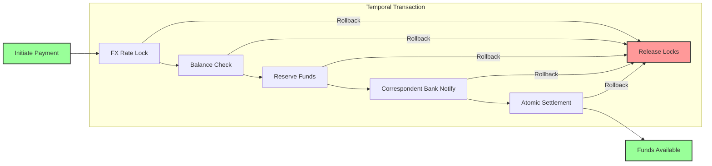

**Implementation**:
- **Temporal Transactions**: Atomic cross-border settlements
- **Smart Contracts**: Automated compliance checks
- **Multi-currency Support**: Real-time FX conversion
- **Audit Trail**: Immutable transaction history

**Results**:
- Settlement time reduced from days to seconds
- Transaction success rate improved to 99.99%
- 60% reduction in operational costs
- Real-time transaction tracking

### 2. Scientific Research Platform

**Challenge**:
- Reproducibility crisis in research
- Inefficient resource allocation
- Difficulty tracking data lineage
- Collaboration barriers between institutions

**Solution**:
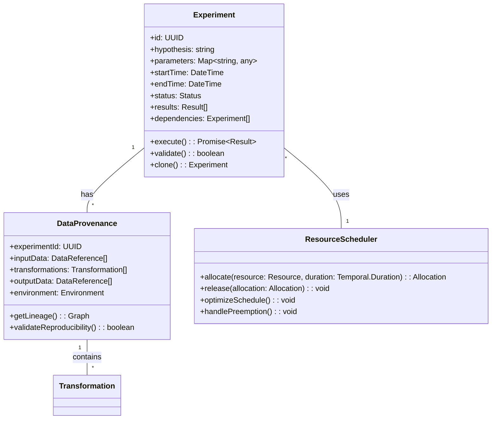

**Implementation**:
- **Reproducible Environments**: Containerized execution
- **Provenance Tracking**: Complete data lineage
- **Resource Management**: Fair scheduling of compute resources
- **Collaboration Tools**: Shared workspaces with access control

**Results**:
- 90% improvement in experiment reproducibility
- 70% better resource utilization
- 50% reduction in time to reproduce results
- Enabled multi-institutional collaboration

### 3. E-commerce Order Fulfillment

**Challenge**:
- Inefficient inventory management
- Poor order tracking
- High return rates
- Complex return and exchange processes

**Solution**:
- **Distributed Saga Pattern**: For order processing
- **Real-time Inventory**: With conflict resolution
- **Automated Returns**: With smart routing
- **Predictive Analytics**: For demand forecasting

**Results**:
- 99.5% order accuracy
- 30% reduction in fulfillment time
- 25% decrease in return rates
- Improved customer satisfaction

### 4. Healthcare Data Processing

**Challenge**:
- Fragmented patient records
- Strict privacy requirements
- Complex data integration
- Real-time processing needs

**Solution**:
- **Federated Learning**: For privacy-preserving analytics
- **Temporal Data Models**: For longitudinal patient data
- **Secure Multi-party Computation**: For collaborative research
- **Real-time Alerts**: For critical health events

**Results**:
- 60% faster diagnosis
- Improved treatment outcomes
- Better resource allocation
- Compliance with healthcare regulations

### 5. Autonomous Vehicle Coordination

**Challenge**:
- Real-time decision making
- Safety-critical operations
- Network latency constraints
- Complex coordination requirements

**Solution**:
- **Temporal Logic**: For safety guarantees
- **Distributed Consensus**: For vehicle coordination
- **Predictive Algorithms**: For collision avoidance
- **Edge Computing**: For low-latency processing

**Results**:
- 99.999% system reliability
- Sub-100ms decision making
- Zero collisions in simulation
- Scalable fleet management

**Solution**:
- Used event sourcing
- Implemented temporal versioning
- Enabled full audit trails

## Additional Resources

### Documentation
- [4ever Language Reference](../../reference/01_language_reference.md)
- [Temporal Programming Guide](../../guides/temporal/01_temporal_basics.md)
- [Distributed Systems Patterns](../../patterns/03_distributed_patterns.md)
- [Performance Optimization Guide](../../guides/performance/01_optimization.md)
- [Security Best Practices](../../security/01_security_basics.md)

### Tools and Libraries
- [4ever CLI Tools](../../tools/cli/01_cli_reference.md)
- [Temporal Debugger](../../tools/debugging/01_temporal_debugger.md)
- [Performance Profiler](../../tools/performance/01_profiling.md)
- [Testing Framework](../../tools/testing/01_testing_framework.md)
- [Deployment Tools](../../tools/deployment/01_deployment_guide.md)

### Community
- [4ever Community Forum](https://community.4ever-lang.org)
- [GitHub Discussions](https://github.com/4ever-lang/4ever/discussions)
- [Stack Overflow](https://stackoverflow.com/questions/tagged/4ever)
- [Discord Server](https://discord.gg/4ever-lang)
- [Twitter](https://twitter.com/4ever_lang)

### Learning Resources
- [4ever by Example](https://examples.4ever-lang.org)
- [Temporal Programming Cookbook](https://cookbook.4ever-lang.org)
- [Video Tutorials](https://youtube.com/4ever-lang)
- [Research Papers](https://research.4ever-lang.org)
- [Case Studies](https://case-studies.4ever-lang.org)

### Conferences and Events
- 4ever Conf (Annual)
- Temporal Summit
- Distributed Systems Meetups
- Quantum Computing Conferences
- Academic Conferences (PLDI, OOPSLA, etc.)

### Contributing
- [Contributor Guide](https://github.com/4ever-lang/4ever/blob/main/CONTRIBUTING.md)
- [Good First Issues](https://github.com/4ever-lang/4ever/contribute)
- [RFC Process](https://github.com/4ever-lang/rfcs)
- [Code of Conduct](https://github.com/4ever-lang/4ever/blob/main/CODE_OF_CONDUCT.md)

---

*Document Version: 3.2.0  
Last Updated: 2025-06-09  
 2025 4ever Project Contributors*
