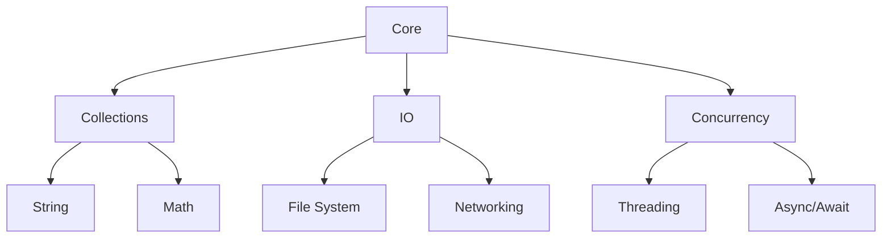

# Mastering the Chronovyan Standard Library

Welcome to the Chronovyan Standard Library Guide! This guide will help you understand how to effectively use the standard library to write idiomatic and efficient Chronovyan code.

## Table of Contents

1. [Introduction](#introduction)
2. [Core Concepts](#core-concepts)
3. [Module Deep Dives](#module-deep-dives)
4. [Common Patterns](#common-patterns)
5. [Performance Optimization](#performance-optimization)
6. [Error Handling](#error-handling)
7. [Testing and Debugging](#testing-and-debugging)
8. [Best Practices](#best-practices)
9. [Migration Guide](#migration-guide)
10. [Resources](#resources)

## Introduction

The Chronovyan Standard Library provides a rich set of modules that cover common programming tasks. This guide will help you understand how to use these modules effectively.

### Philosophy

- **Batteries Included**: Common functionality is available out of the box
- **Consistent API**: Similar operations work the same way across modules
- **Performance First**: Efficient by default, with clear performance tradeoffs
- **Composition**: Modules are designed to work well together

## Core Concepts

### Module Organization



### Common Types and Traits

```chronovyan
// Common type aliases
TYPE Result<T, E> = enum { Ok(T), Err(E) }
TYPE Option<T> = enum { Some(T), None }

// Common traits
TRAIT Iterator {
    TYPE Item;
    FUNC next(&mut self) -> Option<Self::Item>;
    
    // Provided methods
    FUNC collect<B>(self) -> B WHERE B: FromIterator<Self::Item>;
    FUNC map<B, F>(self, f: F) -> Map<Self, F> WHERE F: FnMut(Self::Item) -> B;
    // ...
}
```

## Module Deep Dives

### Collections

#### Vectors

```chronovyan
// Creating vectors
LET v1 = VEC![1, 2, 3];
LET v2 = VEC::with_capacity(10);

// Common operations
v1.push(4);
LET last = v1.pop();
LET first = v1[0];

// Iteration
FOR item IN &v1 {
    println!("Item: {item}");
}

// Functional style
LET sum = v1.iter().sum();
LET doubled: VEC<_> = v1.iter().map(|x| x * 2).collect();
```

#### HashMaps

```chronovyan
USE std.collections as coll;

LET mut scores = coll::HashMap::new();
scores.insert("Blue", 10);
scores.insert("Red", 20);

// Entry API for efficient updates
scores.entry("Blue").and_modify(|e| *e += 1).or_insert(0);

// Iteration
FOR (team, score) IN &scores {
    println!("{team}: {score}");
}
```

## Common Patterns

### Error Handling

```chronovyan
USE std.io as io;
USE std.fs as fs;

FUNC read_file(path: &str) -> Result<String, io::Error> {
    LET mut file = TRY(fs::File::open(path));
    LET mut contents = String::new();
    TRY(io::read_to_string(&mut file, &mut contents));
    RETURN Ok(contents);
}

// Using the function
MATCH read_file("config.toml") {
    Ok(contents) => process_config(&contents),
    Err(e) => eprintln!("Error reading config: {e}"),
}
```

### Concurrency

```chronovyan
USE std.concurrency as conc;
USE std.sync as sync;

FUNC process_data_parallel(data: &[i32]) -> VEC<i32> {
    LET (tx, rx) = conc::channel();
    LET data = Arc::new(data.to_vec());
    
    FOR chunk in data.chunks(data.len() / 4) {
        LET tx = tx.clone();
        LET chunk = chunk.to_vec();
        
        conc::spawn(move || {
            LET processed = expensive_computation(&chunk);
            tx.send(processed).unwrap();
        });
    }
    
    drop(tx);
    rx.iter().flatten().collect()
}
```

## Performance Optimization

### Memory Layout

```chronovyan
// Prefer stack allocation for small, short-lived data
STRUCT Point { x: f64, y: f64 }

// Use references to avoid unnecessary cloning
FUNC process_large_data(data: &[u8]) {
    // Process without taking ownership
}

// Consider using smallvec for small collections
USE smallvec::{SmallVec, smallvec};
LET mut v: SmallVec<[i32; 8]> = smallvec![1, 2, 3];
```

### Iterator Chaining

```chronovyan
// Efficient chaining
LET sum: i32 = numbers.iter()
    .filter(|&&x| x % 2 == 0)
    .map(|&x| x * 2)
    .sum();

// Collect only when needed
LET even_numbers: VEC<_> = numbers.into_iter()
    .filter(|&x| x % 2 == 0)
    .collect();
```

## Error Handling

### Custom Error Types

```chronovyan
USE std.error as error;
USE std.fmt;

ENUM MyError {
    Io(io::Error),
    Parse(String),
    Custom { message: String, code: u32 },
}

IMPL fmt::Display for MyError {
    FUNC fmt(&self, f: &mut fmt::Formatter) -> fmt::Result {
        MATCH self {
            MyError::Io(e) => write!(f, "I/O error: {e}"),
            MyError::Parse(msg) => write!(f, "Parse error: {msg}"),
            MyError::Custom { message, code } => 
                write!(f, "Error {code}: {message}"),
        }
    }
}

IMPL error::Error for MyError {
    FUNC source(&self) -> Option<&(dyn error::Error + 'static)> {
        MATCH self {
            MyError::Io(e) => Some(e),
            _ => None,
        }
    }
}
```

## Testing and Debugging

### Unit Tests

```chronovyan
#[cfg(test)]
MOD tests {
    USE super::*;
    
    #[test]
    FUNC test_addition() {
        assert_eq!(add(2, 2), 4);
    }
    
    #[test]
    #[should_panic(expected = "out of bounds")]
    FUNC test_bounds_check() {
        LET v = VEC![1, 2, 3];
        v[99];
    }
}
```

### Property-Based Testing

```chronovyan
USE std.testing as test;

PROPTEST! {
    TEST_PROP reverse_twice_is_identity(s: String) {
        LET rev = s.chars().rev().collect::<String>();
        LET rev_rev = rev.chars().rev().collect::<String>();
        test::assert_eq!(s, rev_rev);
    }
}
```

## Best Practices

### Code Organization

1. **Module Structure**
   - One type per file
   - Group related functionality
   - Use private modules for implementation details

2. **Documentation**
   ```chronovyan
   /// Calculates the factorial of a number.
   ///
   /// # Examples
   /// ```
   /// assert_eq!(factorial(5), 120);
   /// ```
   FUNC factorial(n: u32) -> u32 {
       MATCH n {
           0 | 1 => 1,
           _ => n * factorial(n - 1),
       }
   }
   ```

### Error Handling

- Use custom error types for your library
- Implement the `Error` trait for your error types
- Use the `?` operator for cleaner error propagation
- Provide context with errors

### Performance

- Prefer iterators over loops
- Use `&str` over `String` when possible
- Consider using `Cow` for optional ownership
- Use `#[inline]` for small, frequently called functions

## Migration Guide

### Upgrading Between Versions

#### Version 1.0 to 2.0

- **Breaking Changes**:
  - `old_function()` is now `new_function()`
  - Changed error type for file operations
  
- **Deprecations**:
  - `deprecated_function()` will be removed in 3.0
  
- **New Features**:
  - Added `new_utility()`
  - Improved performance for common operations

## Resources

### Learning Materials

- [Official Documentation](https://chronovyan.org/docs)
- [Standard Library API Reference](../reference/stdlib/index.md)
- [Chronovyan by Example](https://example.com/chronovyan-by-example)

### Community

- [GitHub Discussions](https://github.com/Chronovyan/Chronovyan/discussions)
- [Discord Server](https://discord.gg/chronovyan)
- [Stack Overflow](https://stackoverflow.com/questions/tagged/chronovyan)

### Tools

- [Chronovyan Language Server](https://github.com/chronovyan/language-server)
- [Chronovyan Formatter](https://github.com/chronovyan/formatter)
- [Chronovyan Linter](https://github.com/chronovyan/linter)

---

© 2023 Chronovyan Project. All rights reserved.
