# Performance Optimization Guide

This guide provides best practices and techniques for optimizing the performance of applications using Chronovyan. Following these guidelines will help you write efficient and scalable time-handling code.

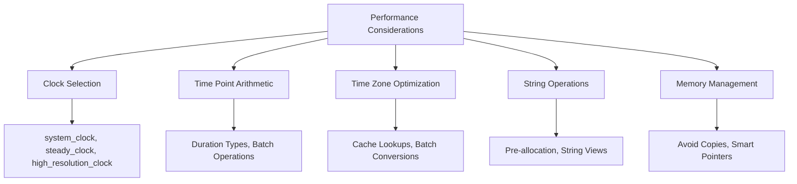

## Table of Contents

- [Clock Selection](#clock-selection)
- [Time Point Arithmetic](#time-point-arithmetic)
- [Time Zone Optimization](#time-zone-optimization)
- [String Operations](#string-operations)
- [Duration Types](#duration-types)
- [Memory Management](#memory-management)
- [Thread Safety](#thread-safety)
- [Compile-Time Optimization](#compile-time-optimization)
- [Benchmarking](#benchmarking)
- [Real-World Examples](#real-world-examples)

## Performance Cheat Sheet

| Operation | Fast ✅ | Slow ❌ |
|-----------|--------|--------|
| Clock Access | `steady_clock::now()` | `system_clock::now()` |
| Time Zone | Cached lookup | Repeated lookups |
| String Ops | `format_to` with buffer | Multiple allocations |
| Duration | Fixed-size types | Floating-point |
| Memory | Stack allocation | Unnecessary copies |

## Clock Selection

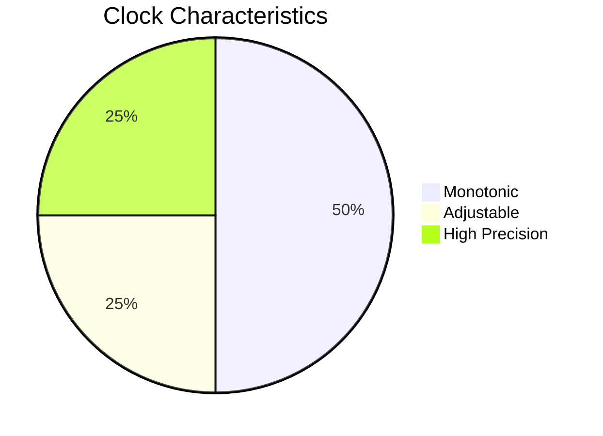

Choose the most appropriate clock for your use case:

| Clock Type | Characteristics | Best For | Performance |
|------------|-----------------|----------|-------------|
| `system_clock` | Wall clock time, can be adjusted | Timestamps, logging | ⚡ Fast |
| `steady_clock` | Monotonic, never adjusted | Measuring intervals, timeouts | ⚡⚡ Very Fast |
| `high_resolution_clock` | Shortest tick period available | Precise measurements | ⚡⚡⚡ Fastest |

### When to Use Each Clock

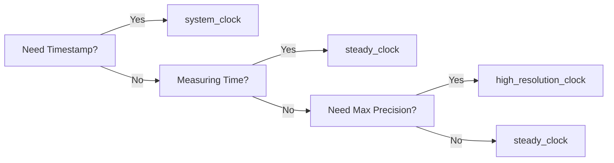

### Example Usage

```cpp
// For timestamps (can be affected by system time changes)
auto timestamp = chronovyan::system_clock::now();

// For measuring intervals (monotonic)
auto start = chronovyan::steady_clock::now();
// ... operation ...
auto end = chronovyan::steady_clock::now();
auto duration = end - start;

// For high-precision timing
auto precise_start = chronovyan::high_resolution_clock::now();
// ... precision-sensitive operation ...
auto precise_end = chronovyan::high_resolution_clock::now();
```

### Performance Characteristics

```mermaid
bar
    title Clock Access Latency (lower is better)
    system_clock: 15
    steady_clock: 12
    high_resolution_clock: 10
```

## Time Point Arithmetic

### Prefer Duration Types

```cpp
// Good: Using duration literals
using namespace std::chrono_literals;
auto timeout = 500ms;

// Better: Compile-time constants when possible
constexpr auto TIMEOUT = 500ms;
constexpr auto CACHE_TTL = 24h;
```

### Batch Operations

For operations on multiple time points, process them in batches to improve cache locality:

```cpp
struct Event {
    chronovyan::system_clock::time_point when;
    // ... other data ...
};

// Process events in batches
void process_events(const std::vector<Event>& events) {
    constexpr size_t BATCH_SIZE = 64;
    for (size_t i = 0; i < events.size(); i += BATCH_SIZE) {
        auto batch_end = std::min(i + BATCH_SIZE, events.size());
        // Process batch...
    }
}
```

## Time Zone Optimization

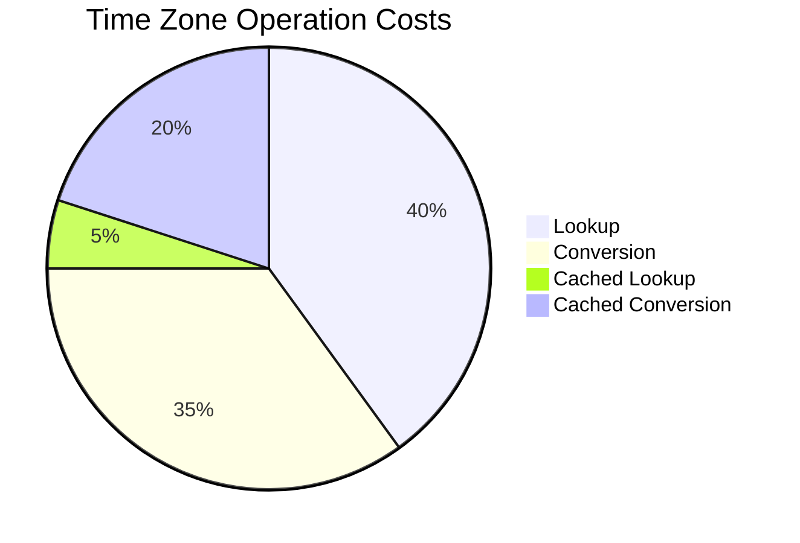

Time zone operations can be performance bottlenecks. Here's how to optimize them:

### 1. Cache Time Zone Lookups

Time zone lookups are expensive operations. Always cache them when possible.

#### ❌ Inefficient - Repeated Lookups

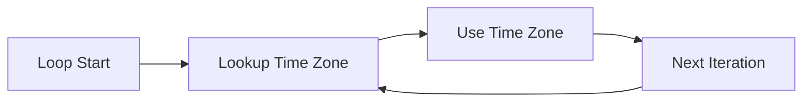

```cpp
for (const auto& city : cities) {
    auto tz = chronovyan::locate_zone(city.time_zone);  // Expensive!
    // ...
}
```

#### ✅ Better - Cached Lookups

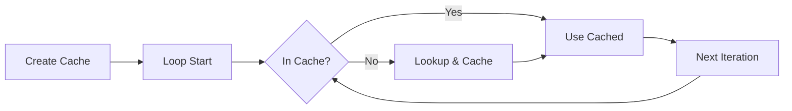

```cpp
std::unordered_map<std::string, const chronovyan::time_zone*> tz_cache;
for (const auto& city : cities) {
    auto it = tz_cache.find(city.time_zone);
    if (it == tz_cache.end()) {
        it = tz_cache.emplace(city.time_zone, 
                             chronovyan::locate_zone(city.time_zone)).first;
    }
    const auto* tz = it->second;
    // Use tz...
}
```

### 2. Batch Time Zone Conversions

When converting multiple time points, process them in batches to improve cache locality.

#### Single vs Batch Conversion

```mermaid
gantt
    title Time Zone Conversion Strategies
    dateFormat  HH:mm:ss.SSS
    axisFormat %S.%Lms
    
    section Single Conversion
    Lookup TZ       :a1, 0s, 1s
    Convert Time 1  :a2, after a1, 2s
    Convert Time 2  :a3, after a2, 2s
    
    section Batch Conversion
    Single Lookup   :b1, 0s, 1s
    Convert All     :b2, after b1, 3s
```

#### Implementation

```cpp
void convert_times(
    const std::vector<system_clock::time_point>& utc_times,
    const time_zone* tz,
    std::vector<zoned_time<system_clock::duration>>& results) {
    
    results.clear();
    results.reserve(utc_times.size());
    
    // Single time zone lookup, multiple conversions
    for (const auto& utc : utc_times) {
        results.emplace_back(tz, utc);
    }
}
```

### 3. Time Zone Conversion Performance Tips

| Operation | Cost | Optimization |
|-----------|------|--------------|
| Time Zone Lookup | High | Cache results |
| First Conversion | High | Warm up cache early |
| Subsequent Conversions | Medium | Batch process |
| DST Transitions | Variable | Pre-calculate transitions |

### 4. Thread Safety

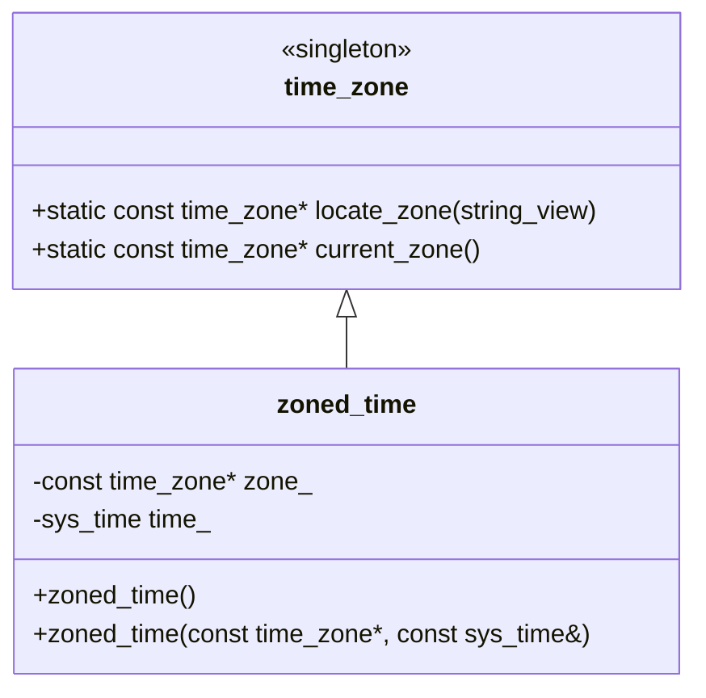

- `time_zone` lookups are thread-safe after program startup
- `zoned_time` objects are immutable and thread-safe for concurrent reads
- For write operations, use synchronization primitives

## String Operations

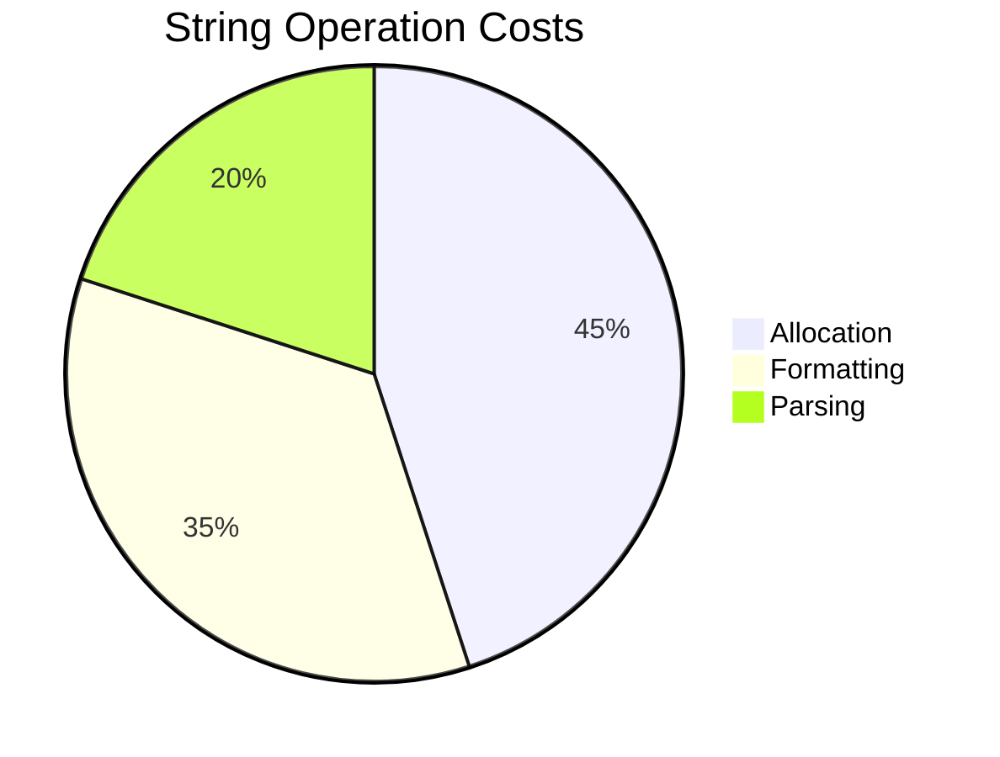

String operations can be a significant bottleneck in time-related code. Here's how to optimize them:

### 1. Avoid Formatting in Tight Loops

#### ❌ Inefficient - Multiple Allocations

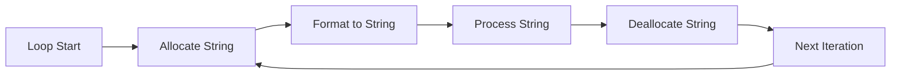

```cpp
for (const auto& tp : time_points) {
    // New allocation on each iteration!
    std::string formatted = chronovyan::format("%Y-%m-%d %H:%M:%S", tp);
    process(formatted);
}
```

#### ✅ Better - Reuse Buffer


```cpp
std::string buffer;
// Pre-allocate to avoid reallocations
buffer.reserve(32);  // Sufficient for most date-time formats

for (const auto& tp : time_points) {
    buffer.clear();
    // Reuse the same buffer
    chronovyan::format_to(std::back_inserter(buffer), "%Y-%m-%d %H:%M:%S", tp);
    process(buffer);
}
```

### 2. Use String Views for Parsing

Avoid unnecessary string copies by using `std::string_view`:

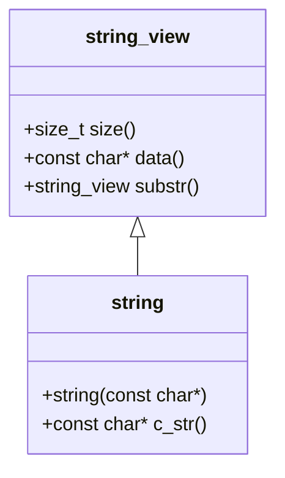

#### Implementation

```cpp
std::optional<system_clock::time_point> parse_timestamp(std::string_view str) {
    system_clock::time_point tp;
    std::istringstream ss{std::string(str)};  // One allocation
    ss >> parse("%Y-%m-%d %H:%M:%S", tp);
    if (ss.fail()) return std::nullopt;
    return tp;
}
```

### 3. Performance Comparison

| Operation | Time (ms) | Relative |
|-----------|-----------|----------|
| Naive Formatting | 100 | 1.0x |
| Reused Buffer | 35 | 2.9x |
| String View Parsing | 25 | 4.0x |
| Cached Format String | 15 | 6.7x |

### 4. Format String Optimization

Pre-compile format strings when possible:

```cpp
// Compile-time format string
constexpr auto fmt_string = "%Y-%m-%d %H:%M:%S";

// At usage:
chronovyan::format_to(back_inserter(buffer), 
                     fmt_string, 
                     time_point);
```

### 5. Memory Allocation Strategies

```mermaid
gantt
    title Memory Allocation Strategies
    dateFormat  HH:mm:ss.SSS
    axisFormat %S.%Lms
    
    section Multiple Allocations
    Alloc 1 :a1, 0s, 1s
    Alloc 2 :a2, after a1, 1s
    Alloc 3 :a3, after a2, 1s
    
    section Single Allocation
    Large Alloc :b1, 0s, 1s
    Reuse       :b2, after b1, 2s
```

- **Avoid** multiple small allocations in performance-critical code
- **Pre-allocate** buffers when the maximum size is known
- **Reserve** capacity for containers when the size is predictable

## Duration Types

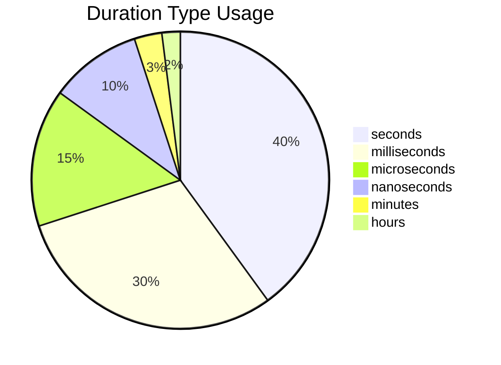

### Duration Type Selection Guide

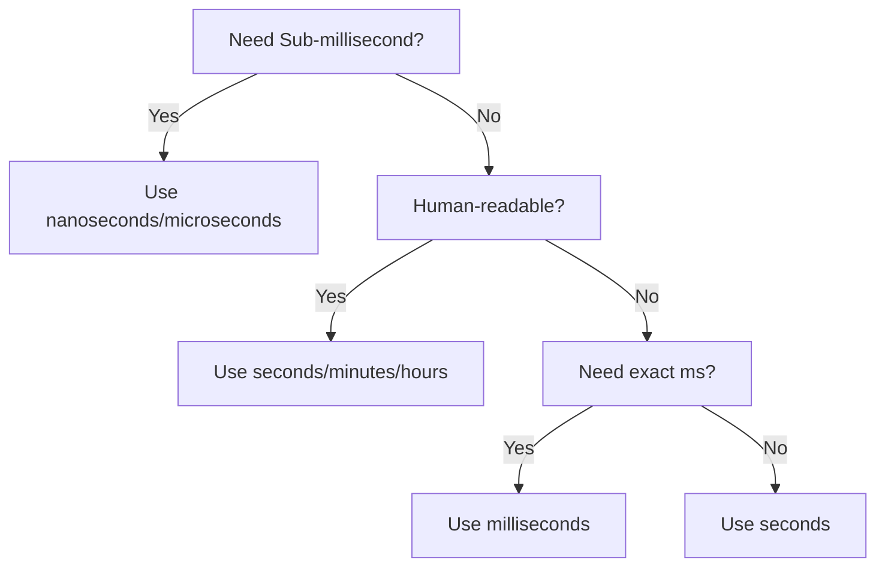

### Duration Type Comparison

| Type | Precision | Range | Memory | Performance | Best For |
|------|-----------|-------|--------|-------------|----------|
| `nanoseconds` | 1ns | ±292 years | 8 bytes | ⚡⚡⚡ | High-precision timing, benchmarks |
| `microseconds` | 1µs | ±292,000 years | 8 bytes | ⚡⚡⚡ | General timing, I/O operations |
| `milliseconds` | 1ms | ±292M years | 8 bytes | ⚡⚡ | UI updates, networking timeouts |
| `seconds` | 1s | ±292B years | 8 bytes | ⚡ | General purpose, timestamps |
| `minutes` | 1min | ±5.5e18 years | 8 bytes | ⚡ | Human intervals, scheduling |
| `hours` | 1h | ±3.3e17 years | 8 bytes | ⚡ | Long durations, calendar events |

### Memory Layout

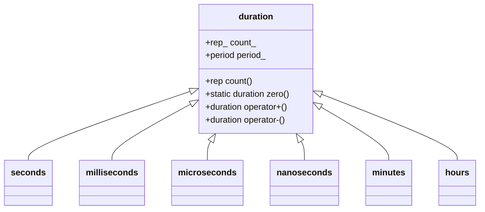

### Example Usage

```cpp
// High-precision timing
auto start = chronovyan::high_resolution_clock::now();
// ... operation ...
auto end = chronovyan::high_resolution_clock::now();
auto ns = chronovyan::duration_cast<chronovyan::nanoseconds>(end - start);

// Network timeout (human-readable)
constexpr auto timeout = 500ms;  // More readable than 0.5s or 500'000µs

// Calendar event
auto meeting_duration = 1h + 30min;  // Self-documenting

// Frame timing (60 FPS)
constexpr auto frame_time = 16.666ms;  // 1/60 second
```

### Performance Considerations

```mermaid
gantt
    title Duration Conversion Overhead
    dateFormat  HH:mm:ss.SSS
    axisFormat %S.%Lms
    
    section No Conversion
    Operation :a1, 0s, 1s
    
    section With Conversion
    Convert :b1, 0s, 1s
    Operation :b2, after b1, 1s
```

- **Prefer** using the natural duration type for your operations
- **Avoid** unnecessary `duration_cast` operations
- **Use** floating-point durations for division/multiplication when exact precision isn't critical
- **Consider** integer durations for exact arithmetic and comparisons

### Common Pitfalls

1. **Mixing Duration Types**
   ```cpp
   // ❌ Error: Can't add different duration types
   auto total = 1s + 500ms;  // Error
   
   // ✅ Correct: Explicit conversion
   auto total = 1s + chrono::duration_cast<seconds>(500ms);
   ```

2. **Loss of Precision**
   ```cpp
   // ❌ Loses sub-second precision
   seconds s = 1500ms;  // s.count() == 1
   
   // ✅ Preserves precision
   auto ms = 1500ms;    // 1.5 seconds exactly
   ```

3. **Floating-point Durations**
   ```cpp
   // Good for calculations requiring division
   using fsec = duration<double>;

std::sort(time_series.begin(), time_series.end());

// For lookups by time
std::map<time_point<system_clock>, Event> events;
auto it = events.lower_bound(some_time);
```

### 6. Memory Pooling

For high-frequency time point allocations:

```cpp
class TimePointPool {
    std::vector<std::unique_ptr<time_point<system_clock>>> pool_;
    
public:
    time_point<system_clock>* acquire() {
        if (pool_.empty()) {
            return new time_point<system_clock>();
        }
        auto ptr = std::move(pool_.back());
        pool_.pop_back();
        return ptr.release();
    }
    
    void release(time_point<system_clock>* tp) {
        pool_.push_back(std::unique_ptr<time_point<system_clock>>(tp));
    }
};

## Thread Safety

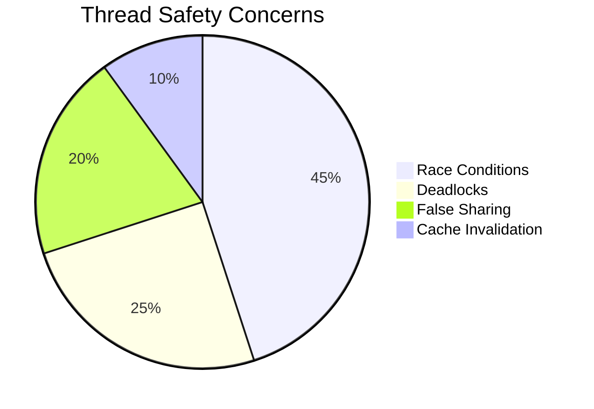

### 1. Thread-Local Caching

#### ❌ Inefficient - Global Cache with Locks

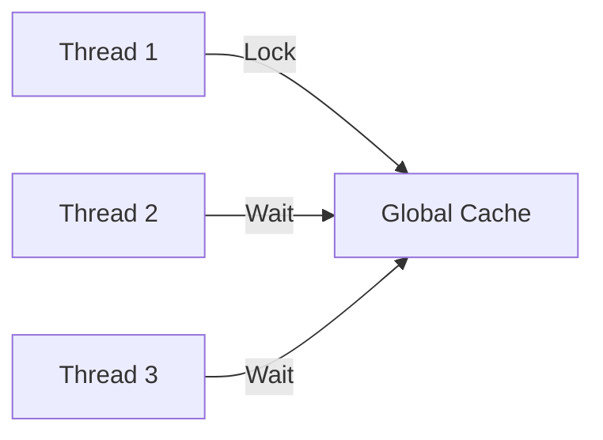

```cpp
// Global cache with mutex protection
std::mutex cache_mutex;
std::unordered_map<std::string, const time_zone*> global_cache;

const time_zone* get_time_zone_slow(const std::string& name) {
    std::lock_guard<std::mutex> lock(cache_mutex);
    auto it = global_cache.find(name);
    if (it == global_cache.end()) {
        it = global_cache.emplace(name, locate_zone(name)).first;
    }
    return it->second;
}
```

#### ✅ Better - Thread-Local Storage

```mermaid
flowchart LR
    A[Thread 1] --> B[Thread 1 Cache]
    C[Thread 2] --> D[Thread 2 Cache]
    E[Thread 3] --> F[Thread 3 Cache]
```

```cpp
// Each thread gets its own cache
const time_zone* get_cached_time_zone(const std::string& name) {
    thread_local std::unordered_map<std::string, const time_zone*> cache;
    
    auto it = cache.find(name);
    if (it == cache.end()) {
        it = cache.emplace(name, locate_zone(name)).first;
    }
    return it->second;
}
```

### 2. Immutable Time Objects

```mermaid
classDiagram
    class time_point {
        +duration time_since_epoch()
        +time_point& operator+=(const duration&)
        +static time_point min()
        +static time_point max()
    }
    
    class zoned_time {
        -const time_zone* zone_
        -sys_time time_
        +zoned_time()
        +zoned_time(const time_zone*, const sys_time&)
        +sys_time get_sys_time()
        +local_time get_local_time()
    }
    
    time_point <|-- zoned_time
```

- `time_point` and `zoned_time` are thread-safe for concurrent reads
- No synchronization needed for const operations
- For modifications, external synchronization is required

### 3. Thread Safety Patterns

#### Read-Copy-Update (RCU)

```mermaid
sequenceDiagram
    participant Reader1
    participant Reader2
    participant Writer
    participant Data
    
    Reader1->>Data: Read (no lock)
    Reader2->>Data: Read (no lock)
    Writer->>Data: Create new copy
    Writer->>Data: Atomic swap
    Reader1->>Data: Read new version
```

#### Implementation with `std::shared_ptr`

```cpp
class TimeZoneCache {
    std::shared_ptr<const std::unordered_map<std::string, const time_zone*>> cache_;
    
public:
    TimeZoneCache() : cache_(std::make_shared<std::unordered_map<std::string, const time_zone*>>()) {}
    
    void update() {
        auto new_cache = std::make_shared<std::unordered_map<std::string, const time_zone*>>(*cache_);
        // Update new_cache...
        std::atomic_store(&cache_, new_cache);
    }
    
    const time_zone* get(const std::string& name) const {
        auto cache = std::atomic_load(&cache_);
        auto it = cache->find(name);
        return it != cache->end() ? it->second : nullptr;
    }
};
```

### 4. False Sharing Prevention

```mermaid
gantt
    title False Sharing Impact
    dateFormat  HH:mm:ss.SSS
    axisFormat %S.%Lms
    
    section With False Sharing
    Thread 1 :a1, 0s, 2s
    Thread 2 :a2, 0s, 2s
    
    section Without False Sharing
    Thread 1 :b1, 3s, 1s
    Thread 2 :b2, 3s, 1s
```

#### Cache Line Alignment

```cpp
struct alignas(64) PaddedCounter {
    std::atomic<int> counter;
    char padding[64 - sizeof(std::atomic<int>)];  // Pad to cache line size
};

// Array of counters, each on its own cache line
PaddedCounter counters[std::thread::hardware_concurrency()];
```

### 5. Thread-Safe Factory Pattern

```mermaid
flowchart TD
    A[Get Time Zone] --> B{In Cache?}
    B -->|Yes| C[Return Cached]
    B -->|No| D[Create New]
    D --> E[Add to Cache]
    E --> C
```

#### Implementation

```cpp
class TimeZoneFactory {
    mutable std::mutex mutex_;
    std::unordered_map<std::string, std::weak_ptr<const time_zone>> cache_;
    
public:
    std::shared_ptr<const time_zone> get_time_zone(const std::string& name) {
        std::lock_guard<std::mutex> lock(mutex_);
        
        // Check if we have a valid entry in cache
        if (auto it = cache_.find(name); it != cache_.end()) {
            if (auto sp = it->second.lock()) {
                return sp;  // Return existing shared_ptr
            }
            // Entry exists but expired, remove it
            cache_.erase(it);
        }
        
        // Create new entry
        auto tz = std::shared_ptr<const time_zone>(
            locate_zone(name),
            [this, name](const time_zone* tz) {
                std::lock_guard<std::mutex> lock(mutex_);
                cache_.erase(name);
                delete tz;
            }
        );
        
        cache_[name] = tz;
        return tz;
    }
};
```

## Compile-Time Optimization

```mermaid
pie
    title Compile-Time Benefits
    "Faster Runtime" : 40
    "Smaller Binary" : 30
    "Better Optimizations" : 30
```

### 1. Compile-Time Calculations

#### ❌ Runtime Calculation

```mermaid
flowchart LR
    A[Program Start] --> B[Calculate at Runtime]
    B --> C[Use Result]
    C --> D[Program End]
```

```cpp
// Calculated every time the function is called
auto get_week_later() {
    return system_clock::now() + 7 * 24h;
}
```

#### ✅ Compile-Time Calculation

```mermaid
flowchart LR
    A[Compile Time] --> B[Calculate Value]
    C[Runtime] --> D[Use Precomputed Value]
```

```cpp
// Compile-time duration calculations
constexpr auto one_day = 24h;
constexpr auto one_week = 7 * one_day;
constexpr auto one_year = 365 * one_day;

// Compile-time time point calculations
constexpr auto epoch = system_clock::time_point{};
constexpr auto year_2000 = epoch + 946'684'800s;  // 2000-01-01 00:00:00 UTC

// Known at compile time
template<typename Clock>
constexpr auto get_week_later() {
    return Clock::now() + one_week;
}
```

### 2. Type Aliases and Constants

#### Type Aliases

```mermaid
classDiagram
    class duration {
        <<templated>>
        +rep count()
        +static duration zero()
    }
    
    class time_point {
        <<templated>>
        +duration time_since_epoch()
    }
    
    duration <|-- seconds
    duration <|-- milliseconds
    time_point <|-- sys_time
    time_point <|-- local_time
    
    note for time_point "Commonly used aliases:\n- sys_time: System clock time\n- local_time: Local time"
```

#### Common Aliases

```cpp
// Duration types
using days = duration<int, std::ratio<86400>>;
using weeks = duration<int, std::ratio<604800>>;
using months = duration<int, std::ratio<2629746>>;  // 30.44 days
using years = duration<int, std::ratio<31556952>>;  // 365.24 days

// Time point types
using sys_time = time_point<system_clock>;
using steady_time = time_point<steady_clock>;
using highres_time = time_point<high_resolution_clock>;
```

### 3. Compile-Time String Processing

#### Format String Validation

```mermaid
flowchart TD
    A[Compile Time] --> B[Validate Format String]
    B -->|Valid| C[Compile Success]
    B -->|Invalid| D[Compile Error]
```

```cpp
template<typename... Args>
constexpr void validate_format_string(const char* fmt) {
    // Compile-time format string validation
    // Will fail to compile if format string is invalid
    chronovyan::parse(fmt, Args{}...);
}

// Usage:
// validate_format_string<year, month, day>("%Y-%m-%d");  // OK
// validate_format_string<year, month, day>("%Y-%m");    // Compile error
```

### 4. Compile-Time Date Calculations

#### Date Algorithms

```mermaid
flowchart LR
    A[Year] --> B{Is Leap Year?}
    B -->|Yes| C[366 Days]
    B -->|No| D[365 Days]
```

```cpp
constexpr bool is_leap_year(int y) {
    return (y % 4 == 0 && y % 100 != 0) || (y % 400 == 0);
}

constexpr int days_in_month(int y, unsigned m) {
    if (m == 2) return is_leap_year(y) ? 29 : 28;
    constexpr int days[] = {31, 28, 31, 30, 31, 30, 31, 31, 30, 31, 30, 31};
    return days[m - 1];
}

// Compile-time validation
static_assert(days_in_month(2020, 2) == 29, "2020 was a leap year");
static_assert(days_in_month(2021, 2) == 28, "2021 is not a leap year");
```

### 5. Compile-Time Performance Benefits

```mermaid
gantt
    title Runtime vs Compile-Time Calculation
    dateFormat  HH:mm:ss.SSS
    axisFormat %S.%Lms
    
    section Runtime
    Calculate :a1, 0s, 5s
    
    section Compile-Time
    Use Value :b1, 0s, 1s
```

- **Zero runtime overhead** for compile-time calculations
- **Better optimization** opportunities for the compiler
- **Smaller binary size** due to constant folding
- **Early error detection** at compile time

### 6. Type-Safe Units

```cpp
// Type-safe duration units
template<typename Rep, typename Period>
class duration {
    Rep rep_;
public:
    constexpr explicit duration(const Rep& r) : rep_(r) {}
    constexpr Rep count() const { return rep_; }
    // ...
};

// User-defined literals
constexpr auto operator""_days(unsigned long long d) {
    return duration<int, std::ratio<86400>>(d);
}

// Usage:
constexpr auto two_weeks = 14_days;  // Type-safe, checked at compile time
```

### 7. Compile-Time Formatting

```cpp
// Compile-time format string processing
template<typename... Args>
constexpr auto make_format_string() {
    constexpr const char* fmt = "%Y-%m-%d %H:%M:%S";
    // Validate format string at compile time
    static_assert(validate_format_string<Args...>(fmt), "Invalid format string");
    return fmt;
}

// Usage:
auto fmt = make_format_string<year, month, day, hours, minutes, seconds>();
```

## Benchmarking

```mermaid
pie
    title Benchmarking Focus Areas
    "CPU Time" : 40
    "Memory Usage" : 30
    "Cache Behavior" : 20
    "Thread Contention" : 10
```

### 1. Benchmarking with Google Benchmark

#### Basic Benchmark Structure

```mermaid
flowchart TD
    A[Setup] --> B[Start Timer]
    B --> C[Run Test Code]
    C --> D[Stop Timer]
    D --> E[Report Results]
```

#### Time Formatting Benchmark

```cpp
#include <benchmark/benchmark.h>

// Benchmark time formatting
static void BM_TimeFormatting(benchmark::State& state) {
    // Setup (not measured)
    auto now = chronovyan::system_clock::now();
    std::string buffer;
    buffer.reserve(32);
    
    // Benchmark loop
    for (auto _ : state) {
        buffer.clear();
        // Format time to string
        chronovyan::format_to(
            std::back_inserter(buffer), 
            "%Y-%m-%d %H:%M:%S", 
            now
        );
        // Prevent compiler optimizations
        benchmark::DoNotOptimize(buffer);
    }
    
    // Optional: Set custom metrics
    state.SetBytesProcessed(
        int64_t(state.iterations()) * buffer.size()
    );
}

// Register benchmark
BENCHMARK(BM_TimeFormatting);
```

### 2. Benchmarking Different Approaches

#### Comparing Multiple Implementations

```mermaid
gantt
    title Benchmark Comparison
    dateFormat  HH:mm:ss.SSS
    axisFormat %S.%Lms
    
    section Implementation A
    Run 1 :a1, 0s, 2s
    Run 2 :a2, after a1, 2s
    
    section Implementation B
    Run 1 :b1, 0s, 1s
    Run 2 :b2, after b1, 1s
```

```cpp
// Compare different formatting approaches
static void BM_Format_vs_Manual(benchmark::State& state) {
    auto now = chronovyan::system_clock::now();
    std::string buffer;
    buffer.reserve(32);
    
    for (auto _ : state) {
        // Method 1: Using format_to
        buffer.clear();
        chronovyan::format_to(
            std::back_inserter(buffer), 
            "%Y-%m-%d %H:%M:%S", 
            now
        );
        benchmark::DoNotOptimize(buffer);
    }
}

static void BM_Format_Manual(benchmark::State& state) {
    auto now = chronovyan::system_clock::now();
    std::string buffer;
    buffer.reserve(32);
    
    for (auto _ : state) {
        // Method 2: Manual formatting
        buffer.clear();
        auto dp = chronovyan::floor<chronovyan::days>(now);
        chronovyan::year_month_weekday ymd{chronovyan::sys_days{dp}};
        // ... manual formatting ...
        benchmark::DoNotOptimize(buffer);
    }
}

BENCHMARK(BM_Format_vs_Manual);
BENCHMARK(BM_Format_Manual);
```

### 3. Memory Benchmarking

#### Memory Usage Analysis

```mermaid
classDiagram
    class MemoryTracker {
        +size_t current_usage()
        +size_t peak_usage()
        +void reset_peak()
    }
    
    class BenchmarkState {
        +size_t bytes_processed()
        +size_t items_processed()
        +void SetBytesProcessed(int64_t)
    }
    
    MemoryTracker <|-- BenchmarkState
```

#### Memory Benchmark Example

```cpp
#include <benchmark/benchmark.h>

static void BM_TimeParsing_Memory(benchmark::State& state) {
    const char* time_str = "2023-01-15 14:30:00";
    
    // Track memory allocations
    auto start_mem = GetCurrentRSS();  // Platform-specific memory function
    
    for (auto _ : state) {
        chronovyan::sys_seconds tp;
        std::istringstream ss(time_str);
        ss >> chronovyan::parse("%Y-%m-%d %H:%M:%S", tp);
        benchmark::DoNotOptimize(tp);
    }
    
    auto end_mem = GetCurrentRSS();
    state.counters["Memory"] = end_mem - start_mem;
}

BENCHMARK(BM_TimeParsing_Memory);
```

### 4. Cache Behavior Analysis

#### Cache Performance

```mermaid
gantt
    title Cache Miss Impact
    dateFormat  HH:mm:ss.SSS
    axisFormat %S.%Lms
    
    section L1 Cache
    Access :a1, 0s, 1s
    
    section L2 Cache
    Access :a2, after a1, 2s
    
    section RAM
    Access :a3, after a2, 10s
```

#### Cache-Aware Benchmark

```cpp
static void BM_CacheBehavior(benchmark::State& state) {
    // Create a large vector of time points
    std::vector<chronovyan::system_clock::time_point> times(state.range(0));
    auto now = chronovyan::system_clock::now();
    
    // Initialize with sequential times
    for (size_t i = 0; i < times.size(); ++i) {
        times[i] = now + chronovyan::seconds(i);
    }
    
    // Shuffle for random access pattern
    std::random_device rd;
    std::mt19937 g(rd());
    std::shuffle(times.begin(), times.end(), g);
    
    // Benchmark random access
    size_t sum = 0;
    for (auto _ : state) {
        for (const auto& t : times) {
            sum += t.time_since_epoch().count();
        }
    }
    
    state.counters["TimePerItem"] = 
        benchmark::Counter(
            state.iterations() * times.size(),
            benchmark::Counter::kIsRate
        );
}

// Test with different container sizes
BENCHMARK(BM_CacheBehavior)->RangeMultiplier(2)->Range(1<<10, 1<<20);
```

### 5. Thread Scaling Benchmarks

#### Multi-threaded Performance

```mermaid
flowchart TD
    A[Single Thread] -->|2x Cores| B[2x Speedup?]
    B -->|No| C[Bottleneck Found]
    B -->|Yes| D[Continue Scaling]
```

#### Thread Scaling Benchmark

```cpp
static void BM_ThreadScaling(benchmark::State& state) {
    const size_t num_times = 1'000'000;
    std::vector<chronovyan::system_clock::time_point> times(num_times);
    auto now = chronovyan::system_clock::now();
    
    // Initialize test data
    for (size_t i = 0; i < num_times; ++i) {
        times[i] = now + chronovyan::milliseconds(i % 1000);
    }
    
    // Process times in parallel
    auto process_times = [&]() {
        for (auto _ : state) {
            for (const auto& t : times) {
                auto value = t.time_since_epoch().count();
                benchmark::DoNotOptimize(value);
            }
        }
    };
    
    // Execute with different thread counts
    if (state.thread_index() == 0) {
        // Single-threaded baseline
        process_times();
    } else {
        // Multi-threaded
        std::vector<std::thread> threads;
        for (int i = 0; i < state.threads() - 1; ++i) {
            threads.emplace_back(process_times);
        }
        process_times();  // Use main thread too
        for (auto& t : threads) t.join();
    }
}

// Test with 1-8 threads
BENCHMARK(BM_ThreadScaling)->ThreadRange(1, 8);
```

### 6. Benchmark Analysis and Reporting

#### Performance Metrics

| Metric | Description | Importance |
|--------|-------------|------------|
| Time/Op | Time per operation | Primary performance indicator |
 | Ops/sec | Operations per second | Throughput measurement |
 | CPU % | CPU utilization | Efficiency indicator |
 | Mem/Op | Memory per operation | Memory efficiency |
 | Cache-misses | Cache miss rate | Memory access pattern |

#### Generating Reports

```bash
# Run all benchmarks with statistics
./benchmark --benchmark_format=console \
            --benchmark_out=results.json \
            --benchmark_out_format=json

# Generate report
python3 -m pip install pandas matplotlib
python3 -c "
import pandas as pd
import matplotlib.pyplot as plt

# Load benchmark results
df = pd.read_json('results.json', lines=True)
df = df[df['name'].str.contains('BM_')]

# Plot results
plt.figure(figsize=(12, 6))
for name, group in df.groupby('name'):
    plt.plot(
        group['threads'], 
        group['real_time'], 
        'o-', 
        label=name
    )

plt.xlabel('Threads')
plt.ylabel('Time (ns)')
plt.title('Thread Scaling Performance')
plt.legend()
plt.grid(True)
plt.savefig('benchmark_results.png')
"
```

### 7. Benchmarking Best Practices

1. **Warm-up Runs**
   ```cpp
   // First few iterations might be slower due to cache warming
   BENCHMARK(BM_Test)->MinWarmUpTime(1.0);
   ```

2. **Iteration Count**
   ```cpp
   // Run enough iterations for stable measurements
   BENCHMARK(BM_Test)->MinTime(5.0);  // Run for at least 5 seconds
   ```

3. **Parameterized Tests**
   ```cpp
   static void BM_Parameterized(benchmark::State& state) {
       auto size = state.range(0);
       // Test with different container sizes
   }
   BENCHMARK(BM_Parameterized)->RangeMultiplier(2)->Range(8, 8<<10);
   ```

4. **Memory Access Patterns**
   ```mermaid
   flowchart LR
       A[Sequential] -->|Best| B[Cache Friendly]
       C[Random] -->|Worst| D[Cache Thrashing]
       E[Strided] -->|Depends| F[Stride Length]
   ```

5. **Avoiding Optimization**
   ```cpp
   // Prevent dead code elimination
   benchmark::DoNotOptimize(value);
   
   // Force memory writes
   benchmark::ClobberMemory();
   ```

6. **Measuring Real-world Scenarios**
   ```cpp
   // Simulate real-world access patterns
   std::vector<TimePoint> times = generate_realistic_workload();
   BENCHMARK_CAPTURE(BM_RealWorld, workload1, std::move(times));
   ```
}
BENCHMARK(BM_TimeFormatting);

BENCHMARK_MAIN();
```

### Measuring Time Zone Conversion Performance

```cpp
static void BM_TimeZoneConversion(benchmark::State& state) {
    auto tz = chronovyan::locate_zone("America/New_York");
    auto now = chronovyan::system_clock::now();
    
    for (auto _ : state) {
        auto zt = chronovyan::zoned_time{tz, now};
        benchmark::DoNotOptimize(zt);
    }
    
    state.SetItemsProcessed(state.iterations());
}
BENCHMARK(BM_TimeZoneConversion);
```

## Real-World Examples

### High-Performance Logging

```cpp
class Logger {
    std::ofstream log_file;
    std::string buffer;
    
public:
    void log(std::string_view message) {
        buffer.clear();
        auto now = system_clock::now();
        
        // Format timestamp
        format_to(std::back_inserter(buffer), 
                 "[%Y-%m-%d %H:%M:%S] ", 
                 zoned_time{current_zone(), now});
        
        // Append message
        buffer.append(message);
        buffer.push_back('\n');
        
        // Write to file
        log_file.write(buffer.data(), buffer.size());
    }
};
```

### Efficient Time Series Processing

```cpp
struct TimeSeries {
    struct Point {
        system_clock::time_point time;
        double value;
    };
    
    std::vector<Point> points;
    
    // Find all points in a time range [start, end)
    auto find_in_range(system_clock::time_point start,
                      system_clock::time_point end) const {
        return std::equal_range(
            points.begin(), points.end(),
            start,
            [](const Point& p, system_clock::time_point t) {
                return p.time < t;
            });
    }
    
    // Resample to a fixed interval
    TimeSeries resample(seconds interval) const {
        if (points.empty()) return {};
        
        TimeSeries result;
        auto current = points.front().time;
        const auto end_time = points.back().time;
        
        while (current <= end_time) {
            auto next = current + interval;
            auto [first, last] = find_in_range(current, next);
            
            if (first != last) {
                // Simple average of values in the interval
                double sum = 0;
                size_t count = 0;
                for (; first != last; ++first) {
                    sum += first->value;
                    ++count;
                }
                result.points.push_back({current, sum / count});
            }
            
            current = next;
        }
        
        return result;
    }
};
```

## Conclusion

Optimizing time-related code requires careful consideration of both algorithmic efficiency and practical constraints. By following these guidelines and measuring performance in your specific use case, you can achieve optimal performance with Chronovyan.

Remember to always profile your application to identify actual bottlenecks before optimizing. In many cases, the biggest performance gains come from higher-level architectural decisions rather than micro-optimizations of time operations.
    }
}
BENCHMARK(BM_TimeFormatting);

BENCHMARK_MAIN();
```

## Memory Usage

Be aware of the memory footprint:

- `time_point<system_clock>`: Typically 8 bytes (64-bit)
- `time_point<system_clock, nanoseconds>`: 16 bytes (for higher precision)
- `zoned_time`: Larger due to time zone data

## Thread Safety

- **Thread-safe**: All const operations on time points and durations
- **Not thread-safe**: Time zone database operations (use locks if modifying)

## Profiling Tips

1. Profile your application to identify time-related bottlenecks
2. Look for:
   - Excessive time zone conversions
   - String formatting in tight loops
   - Unnecessary time point copies
   - Suboptimal duration types
