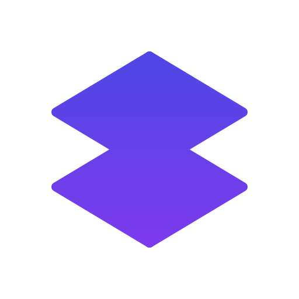
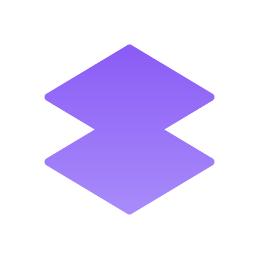

# Branding Guidelines

## Logo Usage

### Primary Logo

**Usage**: Default logo for light backgrounds  
**Minimum Size**: 24px height

### Icon-Only Logo

{ width=100 }

**Usage**: When space is limited or as a favicon  
**Minimum Size**: 16px height

### Dark Mode Logo

{ .dark-light }

**Usage**: For dark backgrounds  
**Minimum Size**: 24px height

## Color Palette

### Primary Colors

  

    

    
Primary Gradient #4F46E5 to #7C3AED

  

  

    

    
Primary Blue #4F46E5

  

  

    

    
Primary Purple #7C3AED

  

### Dark Mode Colors

  

    

    
Dark Mode Gradient #8B5CF6 to #A78BFA

  

  

    

    
Monochrome #1F2937

  

## Typography

### Primary Font
- **Headings**: Inter (SemiBold 600)
- **Body**: Inter (Regular 400)
- **Code**: Fira Code (Regular 400)

## Download Assets

### SVG Files
- [Primary Logo](../assets/branding/svg/logo-primary.svg)
- [Icon-Only Logo](../assets/branding/svg/logo-icon-only.svg)
- [Dark Mode Logo](../assets/branding/svg/logo-dark.svg)
- [Monochrome Logo](../assets/branding/svg/logo-monochrome.svg)

### PNG Files
Various sizes (16px to 2048px) are available in the [PNG directory](../assets/branding/png/).

## Usage Guidelines

### Clear Space
Maintain clear space around the logo equal to the height of the 'F' in the wordmark.

### Minimum Size
- **With Text**: 24px height
- **Icon Only**: 16px height

### Do's and Don'ts

#### Do
- Use SVG format for digital applications
- Maintain aspect ratio when resizing
- Use the appropriate color variant for the background

#### Don't
- Stretch or distort the logo
- Change the colors (except for monochrome applications)
- Rotate the logo
- Add effects like drop shadows or glows
